# Getting Started with the M5StickC Plus

## Contents
- [Introduction](#what-is-the-m5stickc-plus)
- [getting Started](#getting-started)
- [Onboard Components](#onboard-components)
- [Wireless Communication](#wireless-communication)
- [Cloud Services](#cloud-services)
- [Useful Links](#useful-links)

## What is the M5StickC Plus?

The M5StickC Plus is a compact development board created by [M5Stack](https://m5stack.com/). About the size of a thumb; it features an onboard ESP32-PICO-D4 microcontroller with built-in Wi-Fi and Bluetooth modules for wireless communication. 

This board ships with several in-built sensors and actuators and a prebuilt housing, ready for you to start programming straight out of the box.

## Getting Started

[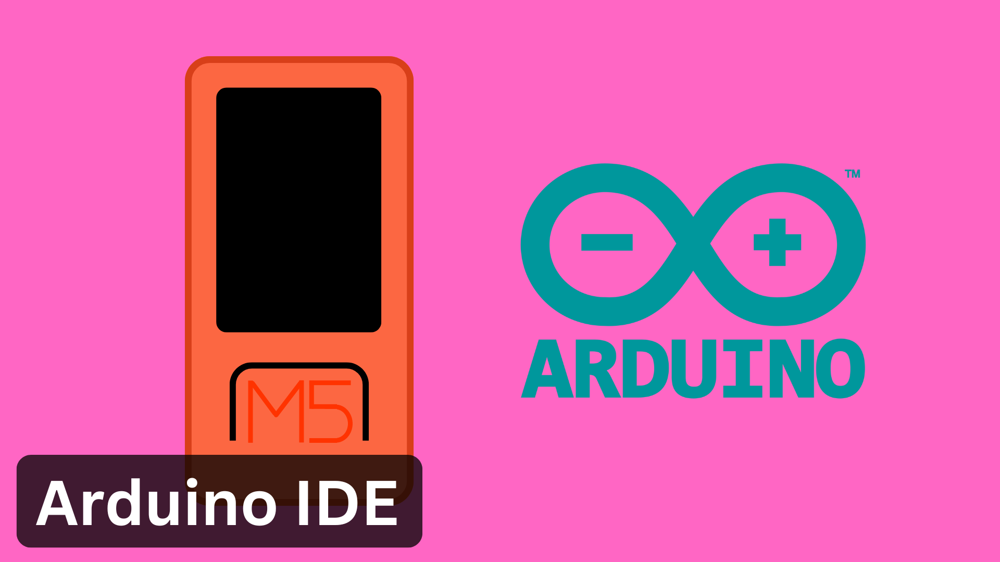](/examples/Getting-Started/ArduinoIDE_Setup/README.md) 
[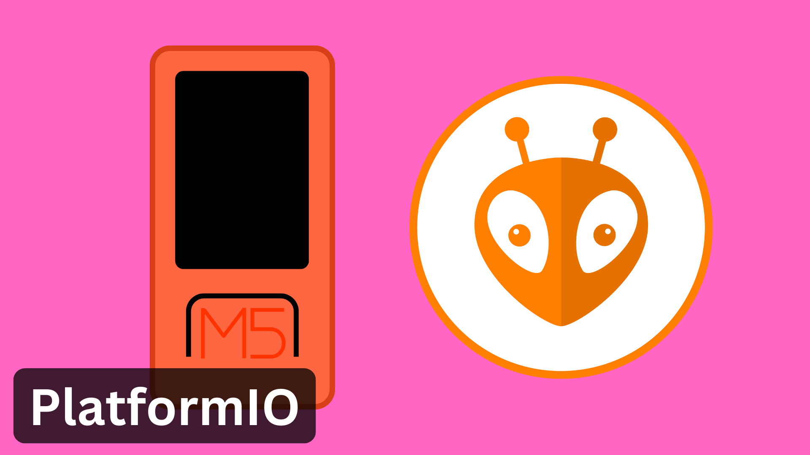](/examples/Getting-Started/PlatformIO_Setup/README.md) 

## Onboard Components

[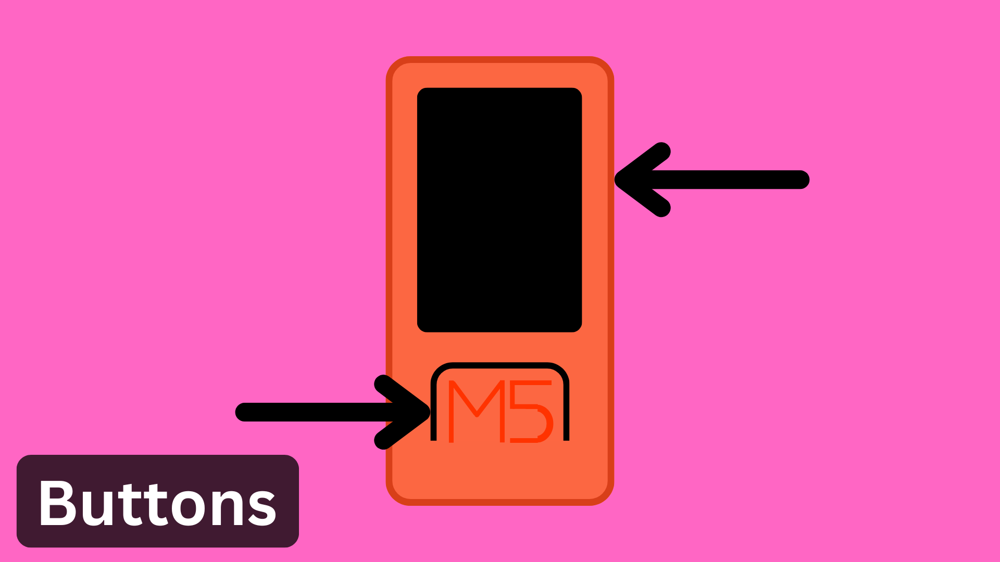](/examples/Onboard-Components/Buttons/) 
[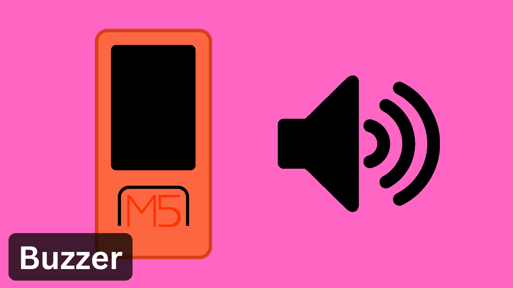](/examples/Onboard-Components/Buzzer/) 
[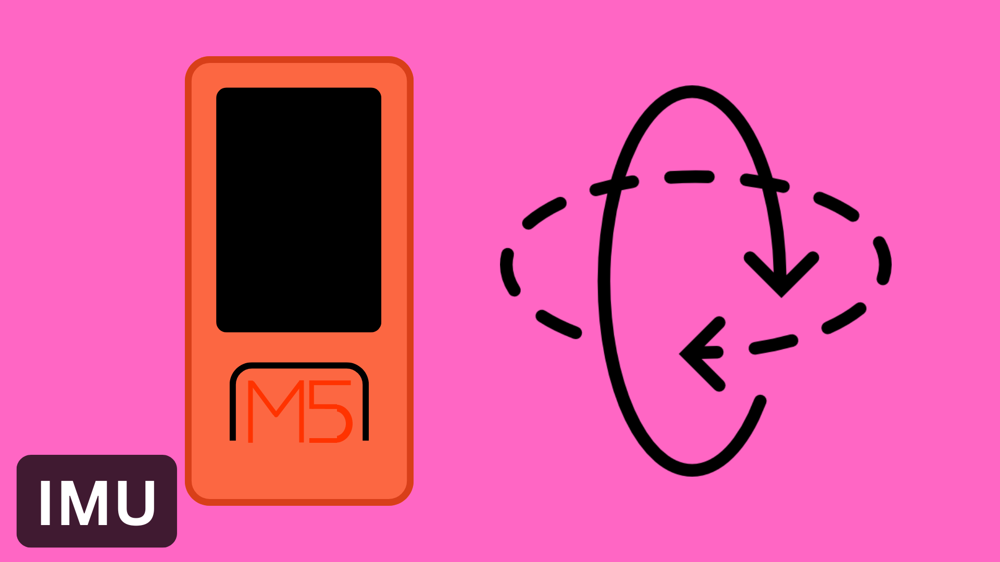](/examples/Onboard-Components/IMU/) 
[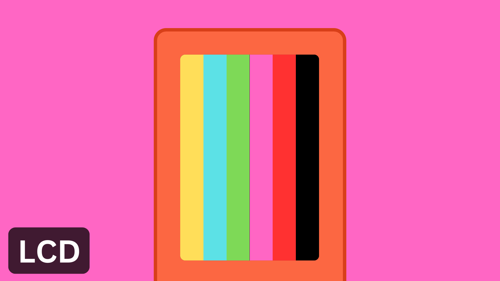](/examples/Onboard-Components/LCD-Display/) 
[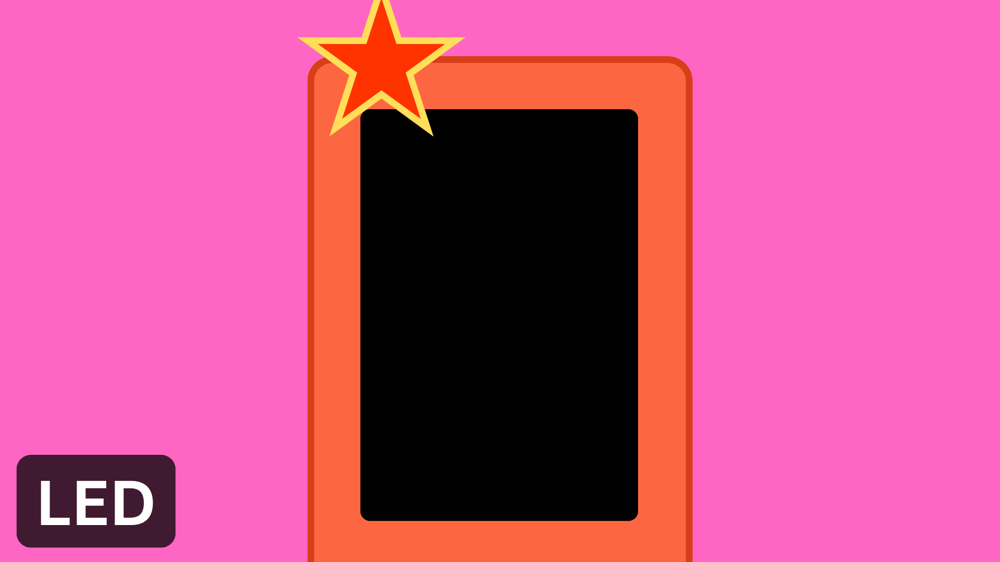](/examples/Onboard-Components/LED/) 
[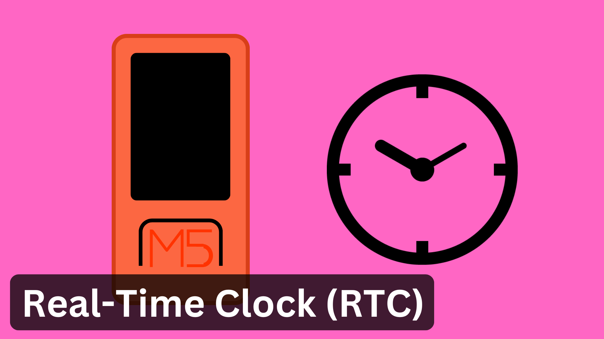](/examples/Onboard-Components/RTC/) 
[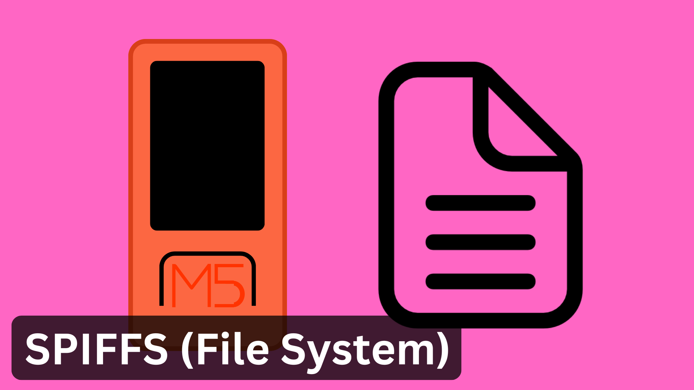](/examples/Onboard-Components/SPIFFS/) 

## Wireless Communication

[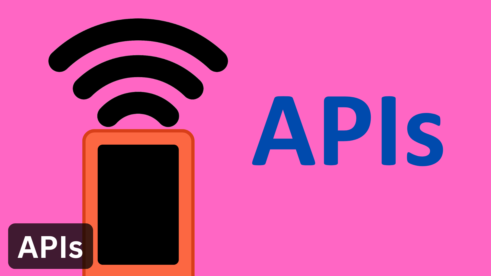](/examples/Wireless-Communication/APIs/) 
[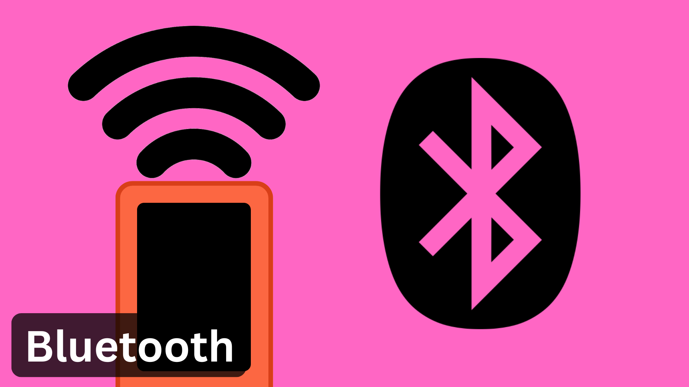](/examples/Wireless-Communication/Bluetooth/) 
[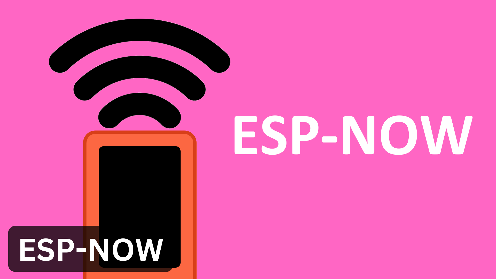](/examples/Wireless-Communication/ESP-NOW/) 
[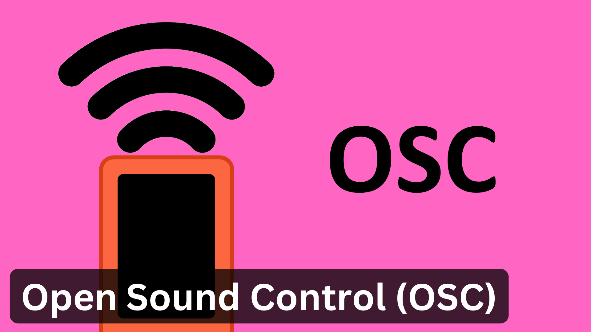](/examples/Wireless-Communication/OSC/) 
[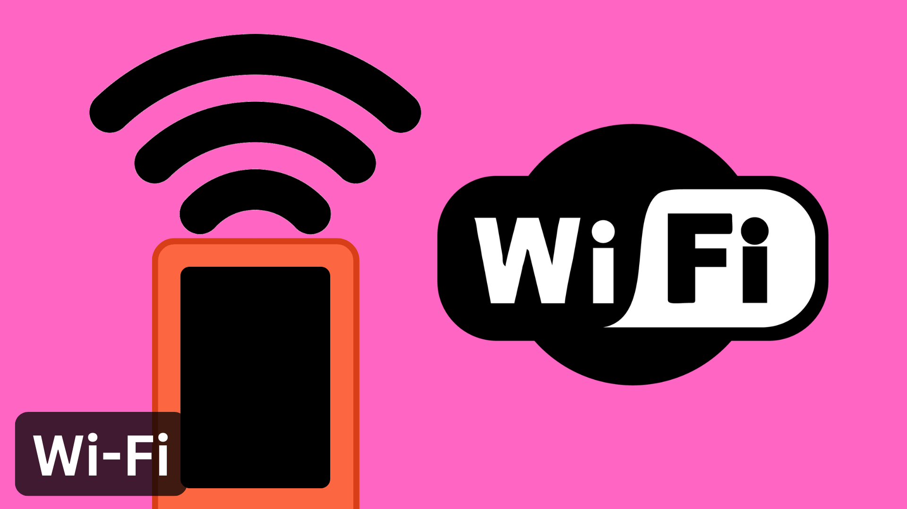](/examples/Wireless-Communication/Wi-Fi/) 

## Cloud Services

[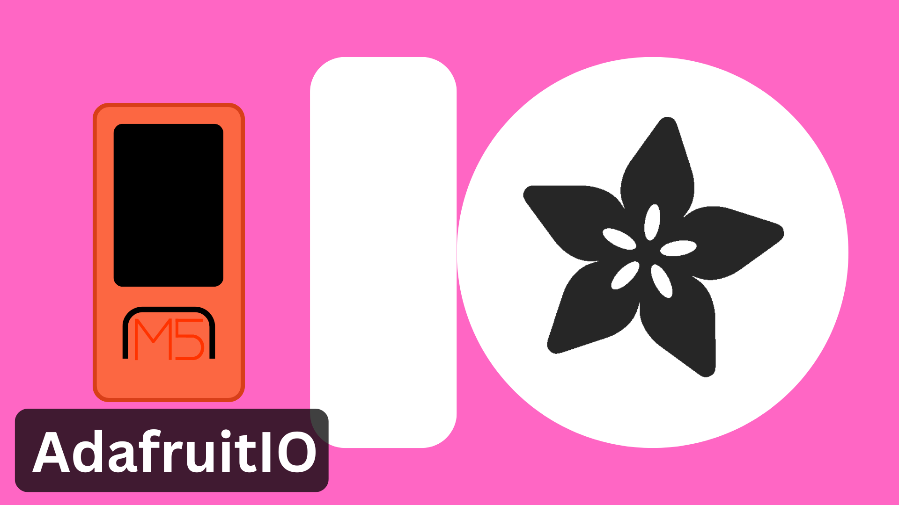](/examples/Cloud-Services/AdafruitIO/) 
[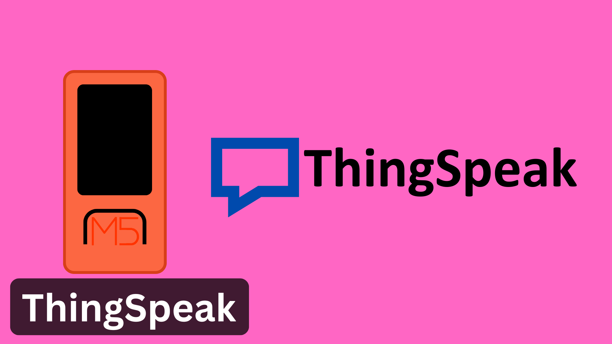](/examples/Cloud-Services/ThingSpeak/) 

## Useful Links

- [M5Stack Arduino Documentation](https://docs.m5stack.com/en/arduino/arduino_ide)
- [M5Stack API Documentation](https://docs.m5stack.com/en/arduino/m5stickc_plus/button)
- [M5Stack Projects](https://m5stack.com/project-hub)
- [PlatformIO](https://platformio.org/)

Sites like [RandomNerdTutorials.com](https://randomnerdtutorials.com/projects-esp32/) provide excellent ESP32 tutorials that should work with the M5StickC Plus.
