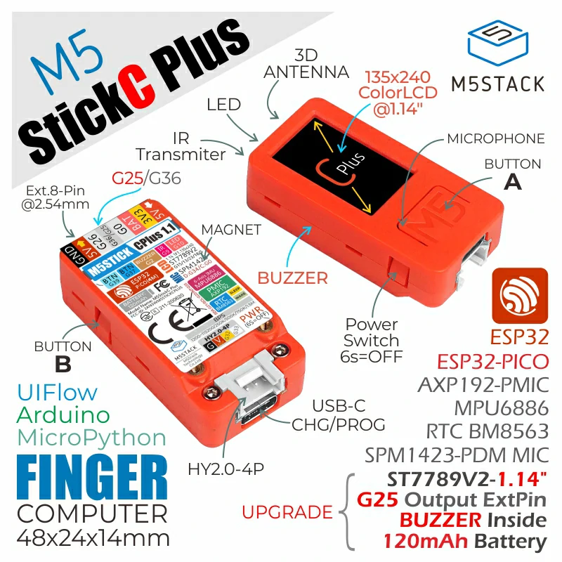
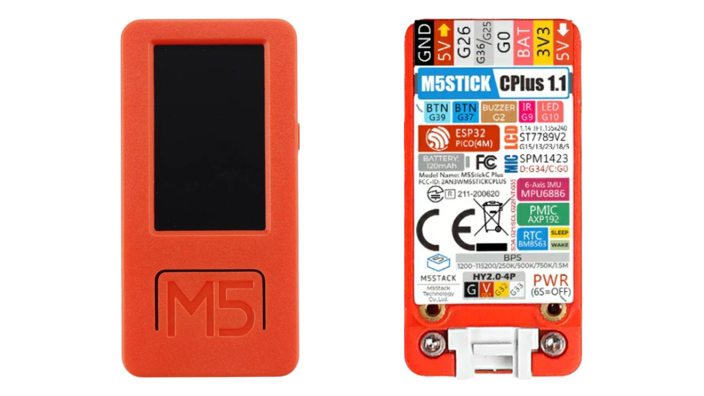

# Getting Started with the M5StickC Plus

## Contents
- [Introduction](#introduction)
    - [What is the M5StickC Plus](#what-is-the-m5stickc-plus)
    - [Onboard Components](#onboard-components)
- [Programming](#programming-options)
    - [Programming Languages](#supported-programming-languages)
    - [Choosing an IDE](#choosing-an-ide)
- [Resources](#resources)
    - [M5Stack Examples](#m5stack-examples)
    - [Tutorial Videos](#tutorial-videos)
    - [Useful Links](#useful-links)

## Introduction
### What is the M5StickC Plus?
The M5StickC Plus is a compact, versatile development board created by [M5Stack](https://m5stack.com/). Launched to enable rapid prototyping and development of electronics projects, it caters to both beginners and experts, making creating IoT projects more accessible and straightforward.

About the size of a thumb; the M5StickC Plus features an onboard ESP32-PICO-D4 microcontroller. For those of you unfamiliar with ESP32, this micrcontroller be likened to a more powerful version of the microcontrollers found on Arduino boards. This allows it to control various electronic components as well as having integrated Wi-Fi and Bluetooth capabilities for wireless communication. You can find more information on this chip by reading the [ESP32-PICO-D4 Datasheet](https://www.espressif.com/sites/default/files/documentation/esp32-pico_series_datasheet_en.pdf).

This board ships with several in-built sensors and components, ready for you to start programming straight out of the box. Additionally, M5Stack have released Arduino board managers and libraries that allow M5Stack boards to be programmed using the Arduino programming language.

### Onboard Components

The M5StickC Plus board ships with several onboard components ready to start programming. M5Stack also provides an Arduino library for using these components. This makes it very easy to start creating projects with the M5StickC Plus.

Here are the main components you can find on an M5StickC Plus board:

- 120mAh LiPo Battery
- [Red LED](/examples/Onboard-Components/LED/README.md)
- [Two Programmable Buttons](/examples/Onboard-Components/Buttons/README.md)
- [1.14" TFT LCD Display](/examples/Onboard-Components/LCD-Display/README.md)
- [Passive Buzzer](/examples/Onboard-Components/Buzzer/README.md)
- [6-Axis Inertial Measurement Unit (IMU)](/examples/Onboard-Components/IMU/README.md)
- [Real-Time Clock (RTC) Module](/examples/Onboard-Components/RTC/README.md)
- [SPI Flash File Storage (SPIFFS)](/examples/Onboard-Components/SPIFFS/README.md)
- IR Transmitter
- Microphone
- [Wi-Fi Module](/examples/Wireless-Communication/Wi-Fi/README.md)
- Bluetooth Module

As well as these components, the M5StickC Plus has three GPIO pins, power supply pins, and a Grove port for connecting even more devices. 

To find out more about what the M5StickC Plus has to offer, as well as technical specifications, you can visit the [M5Stack website](https://docs.m5stack.com/en/core/m5stickc_plus).

## Programming Options
### Supported Programming Languages
The M5StickC Plus contains an ESP32 microcontroller chip that acts as the brains of the device. This chip can be programmed to control the on-board components as well as devices connected to the M5Stick via its header pins and Grove port.

We can use one of a couple of different available programming languages to write and upload code to our M5StickC Plus board, including:

- [Arduino](https://www.arduino.cc/)
- [UIFlow](https://flow.m5stack.com/)
- [MicroPython](http://micropython.org/)
- [.NET nanoFramework](https://github.com/nanoframework/nanoFramework.M5Stack)

For the purpose of these tutorials, we will be focusing on programming the M5StickC Plus using the C++ with Arduino framework, however, you can find out more about the other programming options by clicking the links above.

### Choosing an IDE
To start programming the M5Stick with Arduino framework, you will first need to decide what Integrated Development Environment (IDE) to use. This will be where you write your code and upload it to the M5Stick.

For most beginner applications, the [Arduino IDE](https://docs.arduino.cc/software/ide/) will be a perfectly suitable choice. However, if you would like to take advantage of various extensions and a slightly more professional programming environment, you may want to opt for the [PlatformIO](https://platformio.org/) extension for VS Code. 

You will only need to choose one of these options to go start programming your M5StickC Plus board.

You can find tutorials here for installing setting up your IDE of choice:

- [Arduino IDE](examples/Getting-Started/ArduinoIDE_Setup/README.md)
- [PlatformIO](examples/Getting-Started/PlatformIO_Setup/README.md)

## Resources
### M5Stack Examples
The M5StickCPlus library contains examples that we can use to immediately start programming the M5StickC-Plus. These examples include sketches for using some of the M5Stick's onboard components, as well as some games that you can try out.

In the Arduino IDE, these examples can be found by navigating to:
- **Windows:** File -> Examples -> M5StickCPlus
- **Mac:**     Arduino -> Examples -> M5StickCPlus

In PlatformIO you will have to navigate into the library directory to find these examples. Make sure you have installed the <code>M5StickCPlus.h</code> library ([see here](/examples/Getting-Started/PlatformIO_Setup/README.md#4-install-libraries)) to your project and navigate to .pio -> libdeps -> m5stick-c -> M5StickCPlus -> examples.

### Tutorial Videos
Internal UoE use only.

- [M5StickC-Plus with Arduino IDE](https://media.ed.ac.uk/media/Programming%20M5StickC%20Plus%20with%20Arduino%20IDE%202.0/1_uysgibv8)
- [M5StickC-Plus with PlatformIO](https://media.ed.ac.uk/media/Programming%20M5StickC%20Plus%20with%20PlatformIO/1_chpql4of)
- [Printing Text to the LCD Display](https://media.ed.ac.uk/media/Printing%20Text%20%20to%20the%20M5StickCPlus%20LCD%20Display/1_06kr2wpx)
- [Printing Shapes to the LCD Display](https://media.ed.ac.uk/media/Printing%20Shapes%20to%20the%20M5StickCPlus%20LCD%20Display/1_599jau31)
- [Using the On-board Buttons](https://media.ed.ac.uk/media/Using%20the%20M5StickC%20Plus%20Buttons/1_lcty4juu)
- [Connecting to WiFi](https://media.ed.ac.uk/media/Connect%20M5StickC%20Plus%20to%20WiFi/1_v0f5n2bl)
- [Sending OSC Messages](https://media.ed.ac.uk/media/Sending%20OSC%20Messages%20with%20M5StickC%20Plus/1_jm4bpf9v)

### Useful Links
- [M5Stack Arduino Documentation](https://docs.m5stack.com/en/arduino/arduino_ide)
- [M5Stack API Documentation](https://docs.m5stack.com/en/arduino/m5stickc_plus/button)
- [PlatformIO](https://platformio.org/)
- [RandomNerdTutorials.com](https://randomnerdtutorials.com/projects-esp32/) - these tutorials are not written specifically for the M5StickC Plus but instead for ESP32 boards. Most of these tutorials should work with the M5StickC Plus but may require some modification to the example code.
