# Getting started with the M5StickCPlus

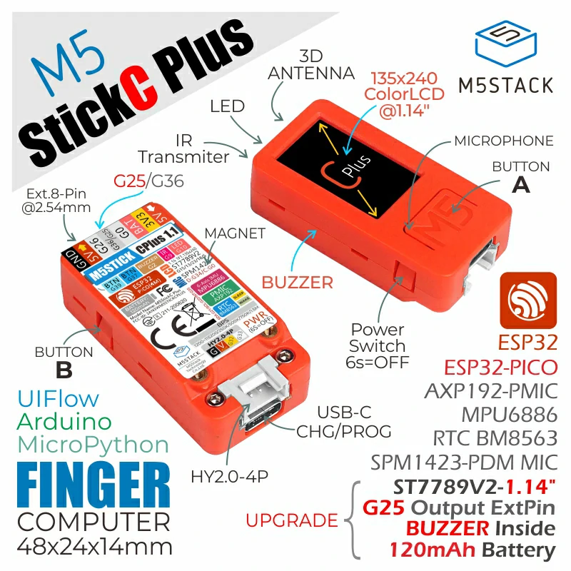

## Contents
- [Introduction](#introduction)
    - [Basic Functions](#basic-functions)
    - [Features](#features)
- [Programming](#programming-the-m5stickcplus)
    - [Arduino IDE](#arduino-ide)
        - [Download](#downlaod-arduino-ide)
        - [Boards Manager](#boards-manager)
        - [Library Manager](#library-manager)
        - [Uploading Code](#uploading-code)
    - [PlatformIO](#platformio)
        - [Download VS Code](#download-vs-code)
        - [Install PlatformIO](#install-platformio-extension)
        - [Set up Project](#set-up-project)
        - [Install Libraries](#install-libraries)
        - [Uploading Code](#upload-code-1)
    - [Hello World](#hello-world)
- [Resources](#resources)
    - [M5Stack Examples](#m5stack-examples)
    - [Tutorial Videos](#tutorial-videos)
    - [Useful Links](#useful-links)

## Introduction
The [M5StickC-Plus](https://docs.m5stack.com/en/core/m5stickc_plus), from M5Stack, is a development board powered by the ESP32-PICO-D4 chip. It is essenstially an [ESP32 PICO board](https://docs.espressif.com/projects/esp-idf/en/latest/esp32/hw-reference/esp32/get-started-pico-kit.html) with several built-in components and a plastic housing for an all-in-one IoY development board without (if you want) the need for soldering or breadboards.   

The board is only 48.2mm x 25.5mm x 13.7mm in size and has been designed to be used in the prototyping of IoT devices. As such, the M5StickC-Plus has WiFi and Bluetooth modules that allow boards to the ability to connect to other devices as well as each other.

### Basic Functions
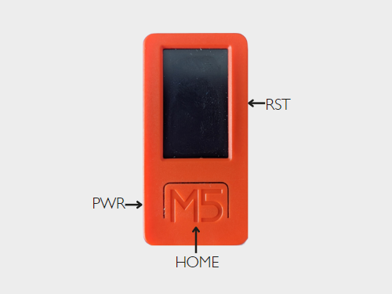

To power the board:
- ON, hold the power button for 2 seconds.
- OFF, hold the power button for 6 seconds.

The M5StickC-Plus can be connected to your computer via the USB-C port at the base of the board. Underneath the USB port, there is a Grove connector for connecting [Grove sensors](https://bookit.eca.ed.ac.uk/av/wizard/resourcedetail.aspx?id=5255).

### Features
- Wi-Fi enabled
- Bluetooth enabled
- LCD(1.14 inch)
- 2 Programmable Buttons
- Built-in 6-Axis IMU
- Red LED
- IR Transmitter
- Microphone
- RTC
- Built-in Lithium Polymer Battery
- Built-in Passive Buzzer
- 5 Digital/Analog IO Pins
- Grove Connector Port

## Programming the M5StickCPlus
You can program the M5StickC-Plus with a variety of platforms, including:
- [Arduino](https://www.arduino.cc/)
- [UIFlow](https://flow.m5stack.com/)
- [MicroPython](http://micropython.org/)
- [.NET nanoFramework](https://github.com/nanoframework/nanoFramework.M5Stack)

For most of this article, we will mostly be looking at programming the M5Stick using C++ with Arduino framework. 

To start programming the M5Stick with Arduino framework, you will first need to decide what Integrated Development Environment (IDE) to use. For most beginner applications, the [Arduino IDE](#arduino-ide) will be perfectly suitable. However, if you would like to take advantage of various extensions and a slightly more professional programming environment, you may want to opt for the [PlatformIO extension to VS Code](#platformio).

You will only need to choose ONE of these options to go forward.

### Arduino IDE
For beginners, I would recommend getting started with the [Arduino IDE](https://www.arduino.cc/). The Arduino IDE is an easy-to-use programming environment, and for those of you who have previous programming experience with Arduino, it may be a familiar interface to navigate. Even for beginners, however, the Arduino IDE has a simple layout and can be quite easy to get to grips with - especially since the release of Arduino IDE 2.0.  

For a video walkthrough of setting up the Arduino IDE for programming the M5StickC-Plus, [follow this link](https://media.ed.ac.uk/media/Programming%20M5StickC%20Plus%20with%20Arduino%20IDE%202.0/1_uysgibv8). Otherwise, follow the instructions below to get started.

#### Download Arduino IDE
You will first need to download to the Arduino IDE from https://www.arduino.cc/en/software. Make sure to select correct download link for your computer's Operating System. 

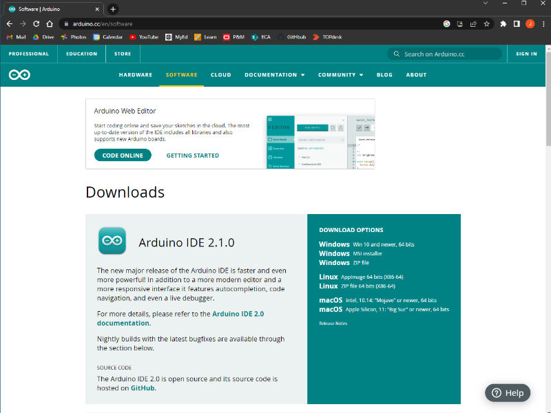

Once the install file has downloaded, you can open the installer in your Downloads folder and follow the on-screen instructions to finish the installation.

#### Boards Manager
In order for the IDE to be able communicate with a development board, it must be given a set of instructions of exactly how to do so. These "instructions" can be downloaded from the Boards Manager tab in the Arduino IDE. However, certain boards (including boards from M5Stack) are not directly available from the Boards Manager, and instead we have to direct the IDE to an additional URL in order to access the "instructions" for that board.

To access the additional Boards Manager, navigate to the IDE Preferences:
- Windows: File -> Preferences
- Mac:     Arduino -> Preferences

Copy and paste this link into the text box next to 'Additional Boards Manager URLs':

```
https://m5stack.oss-cn-shenzhen.aliyuncs.com/resource/arduino/package_m5stack_index.json
```

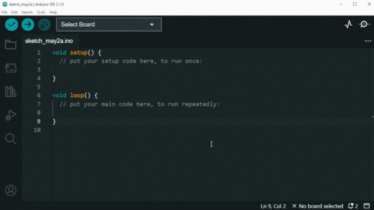

Now you can press 'OK', and navigate to the Boards Manager: Tools -> Board -> Boards Manager...

You may also see that you can access the Boards Manager using an icon on the left-hand side of the IDE.

Search for 'M5Stack', and you should now be able to see 'M5Stack by M5Stack official'. Click *INSTALL*.

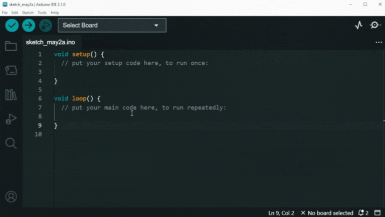

#### Library Manager
In order to make the most of the M5StickC-Plus board, you will need to install the M5StickCPlus library. This contains functions to more easily control the on-board components, such as the LCD screen, IMU, buttons etc.

Navigate to Tools -> Manage Libraries...

Again, you may be able to see that the Library Manager can also be accessed via a tab on the left-hand side of the IDE.

Search for 'M5StickCPlus', and install 'M5StickCPlus by M5Stack'. If you are asked to install extra dependencies, select *INSTALL ALL*.

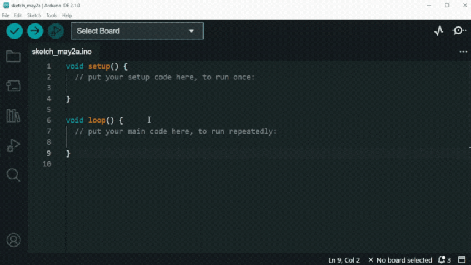

You should now be good to go!

#### Uploading Code
Before starting to code your own projects, it is worth uploading an empty sketch to the M5Stick to ensure everything is working correctly. Make sure your M5Stick is switched on ([see here](#basic-functions)) and connected to your computer via USB.

You may or may not see the correct board and USB port appear automatically at the top of the IDE, like so:

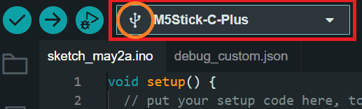

**Note**: This tab may display the correct board, but it is only connected if you see the USB icon next to it.

If not, go to Select Board -> Select other board and port... and manually search for 'M5Stick-C-Plus' and select the USB port you are plugged into. The correct port will usually have *(USB)* appear next to it.

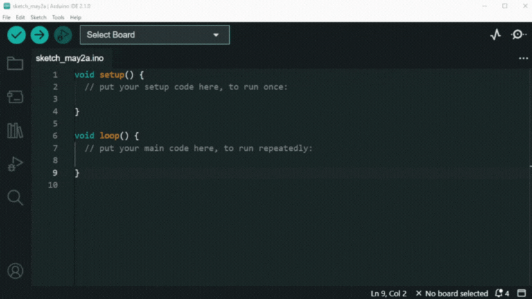

You can now upload to the M5Stick using the Upload icon at the top-left corner of the IDE.

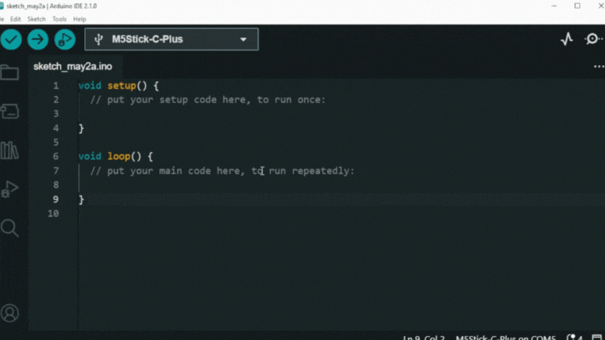

If you see any error messages appear in the console, first ensure you have followed all of the previous steps correctly. If you are still being shown error messages and are unsure of why, feel free to contact support via email at DigiDevECA@ed.ac.uk.

[Jump to Next Section](#hello-world)

### PlatformIO
Although the Arduino IDE offers a simple UI and a few features for programming the M5StickC-Plus, it is lacking in some features that more experienced programmers may be used to. 

Arduino does not easily support extensions or Git control, and the fact that libraries are global across all projects can cause issues if library updates cause older projects to stop working. You may even find that the Arduino IDE takes a long time to compile on your device. If any of these things are the case for you, you want to may consider using PlatformIO.

[PlatformIO](https://platformio.org/) is a free extension to VS Code that allows users to program a wide variety of development boards while making use of a more professional programming environment. Although there is a little more setup and file management involved, it allows for much more control over your projects and more customizable options. 

For a video walkthrough of setting up VS Code and PlatformIO, [follow this link](https://media.ed.ac.uk/media/Programming%20M5StickC%20Plus%20with%20PlatformIO/1_chpql4of). Otherwise, follow the instructions below to get started.

#### Download VS Code
Firstly, you will need to install VS Code from https://code.visualstudio.com/download. Make sure to select correct download link for your computer's Operating System.

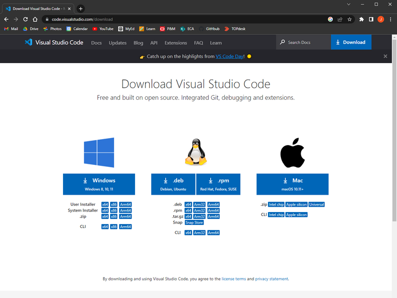

Once downloaded, you can open the installer in your Downloads folder and follow the on-screen instructions to finish the installation.

#### Install PlatformIO Extension
Once VS Code has installed, open the application. You can then navigate to the Extensions tab on the left-hand side of the screen. From there you can search for PlatformIO and install it as an extension.

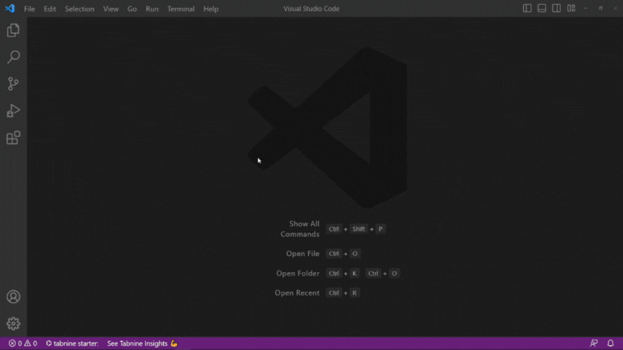

#### Set up Project
For every new M5StickC-Plus project, you will need to create a PlatformIO project. Make sure to follow these steps every time.

After installing PlatformIO, a new tab should appear on the left side of the IDE.


Open the tab and select either *Create New Project* or *Open*. From here you can create a new project and give it a name.

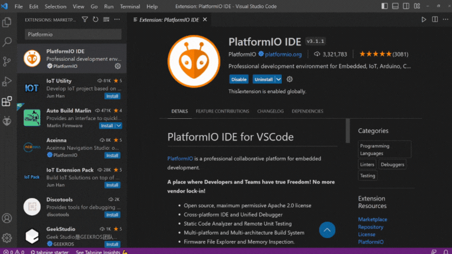

You will also need to select the board you are using from the dropdown menu. Make sure 'Framework' is set to 'Arduino' and create the project. By default, it will saved to the 'PlatformIO' folder inside your Documents.

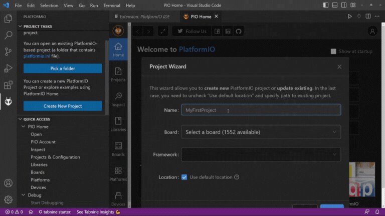

Upon creating a new project, a new window will be created with your project folder. Most of this can be ignored as the majority of what you will be working on will be inside the *src* folder. This includes th main.cpp file that we will be putting most of our code.

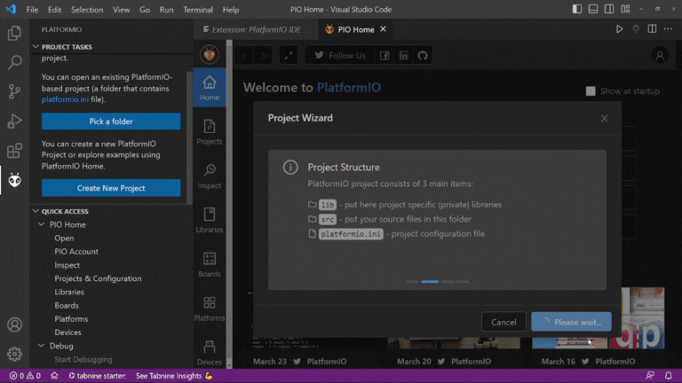

#### Install Libraries
In order to make the most of the M5StickC-Plus board, you will need to install the M5StickCPlus library. This contains functions for much easier control of the on-board components, such as the LCD screen, IMU, buttons etc.

To add the M5StickCPlus library in PlatformIO, navigate to the PlatformIO tab and select 'Libraries'. From here you can search for 'M5StickCPlus' and select 'M5StickCPlus by M5Stack'.

In PlatformIO, libraries are downloaded locally for each project so you will need to select which project you would like to add the library to.

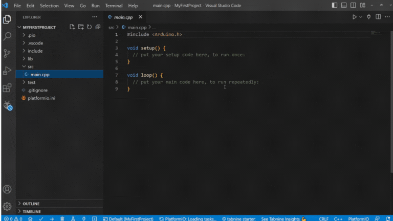

After downloading the library and building your project, you will be able to see it inside the project folder: .pio -> libdeps -> m5stick-c -> M5StickCPlus

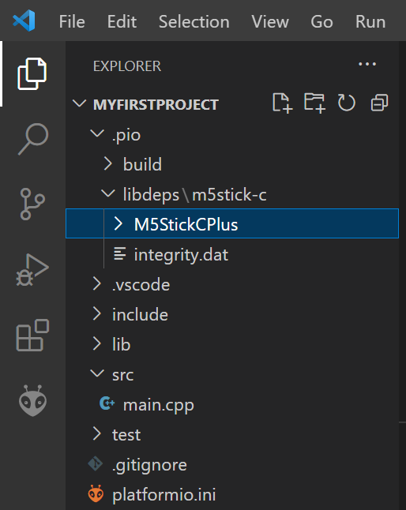

#### Uploading Code
Before starting to code your own projects, it is worth uploading an empty sketch to the M5Stick to ensure everything is working correctly. Make sure your M5Stick is switch on ([see here](#basic-functions)) and connected to your computer via USB.

You can specify the USB port you want to upload to, however this is set to 'Auto' by default and will usually detect the right port.

To upload, select the Upload icon at the bottom-left of the IDE.

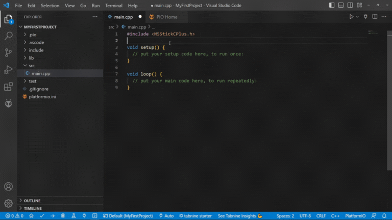

If you see any error messages appear in the console, first ensure you have followed all of the previous steps correctly. If you are still being shown error messages and are unsure of why, feel free to contact support via email: DigiDevECA@ed.ac.uk.

## Hello World
To get started programming the M5StickC-Plus, a simple "Hello World" sketch might be a nice place to start.

First of all, for every M5StickC-Plus project, you should include the M5StickCPlus library at the top of the code.

``` cpp
#include <M5StickCPlus.h>
```

You should also include the <code>M5.begin()</code> function inside the <code>setup()</code> function. This will initialize all of the onboard components (LCD, buttons, IMU etc).

``` cpp
void setup() {
    M5.begin();
}
```

To print to the LCD, we can use the <code>M5.Lcd.print()</code> function given to us by the M5StickCPlus library. To make sure we are not printing anything too quickly, we can add a short delay to the <code>loop()</code> function also.

``` cpp
void loop() {
    M5.Lcd.print("Hello World");
    delay(1000);
}
```

If successful, this should print out the words "Hello World" to the LCD screen every second.

## Resources
### M5Stack Examples
The M5StickCPlus library contains examples that we can use to immediately start programming the M5StickC-Plus. These examples include tutorials on how to use some of the functions in the M5StickCPlus library, as well as some games that you can try out.

In the Arduino IDE, these examples can bee found under:
- Windows: File -> Examples -> M5StickCPlus
- Mac:     Arduino -> Examples -> M5StickCPlus

In PlatformIO yu will have to navigate into the library directory to find these examples. Inside your project folder, navigate to .pio -> libdeps -> m5stick-c -> M5StickCPlus -> examples. Make sure that you have infact [installed the library to that project](#install-libraries) before looking for it.

### Tutorial Videos
- [M5StickC-Plus with Arduino IDE](https://media.ed.ac.uk/media/Programming%20M5StickC%20Plus%20with%20Arduino%20IDE%202.0/1_uysgibv8)
- [M5StickC-Plus with PlatformIO](https://media.ed.ac.uk/media/Programming%20M5StickC%20Plus%20with%20PlatformIO/1_chpql4of)
- [Printing Text to the LCD Display](https://media.ed.ac.uk/media/Printing%20Text%20%20to%20the%20M5StickCPlus%20LCD%20Display/1_06kr2wpx)
- [Printing Shapes to the LCD Display](https://media.ed.ac.uk/media/Printing%20Shapes%20to%20the%20M5StickCPlus%20LCD%20Display/1_599jau31)
- [Using the On-board Buttons](https://media.ed.ac.uk/media/Using%20the%20M5StickC%20Plus%20Buttons/1_lcty4juu)
- [Connecting to WiFi](https://media.ed.ac.uk/media/Connect%20M5StickC%20Plus%20to%20WiFi/1_v0f5n2bl)
- [Sending OSC Messages](https://media.ed.ac.uk/media/Sending%20OSC%20Messages%20with%20M5StickC%20Plus/1_jm4bpf9v)

### Useful Links
- [M5Stack Arduino Documentation](https://docs.m5stack.com/en/quick_start/m5stickc_plus/arduino)
- [M5Stack API Documentation](https://docs.m5stack.com/en/api/stickc/system_m5stickc)
- [PlatformIO](https://platformio.org/)
- [These tutorials](https://randomnerdtutorials.com/projects-esp32/) are for familiarizing with the ESP32 board. You will just need to add the M5StickCPlus.h library and M5.begin() function to these examples for them to work with M5StickC-Plus.