# AdafruitIO with M5StickCPlus

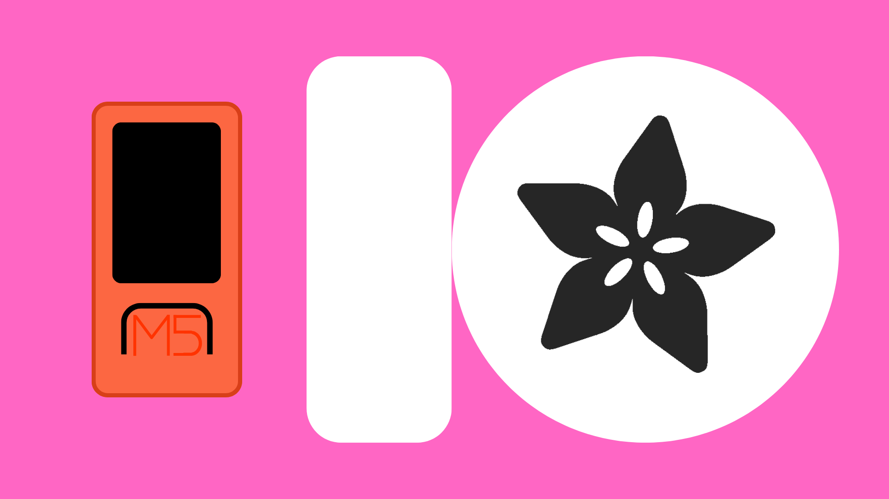

## Contents
- [Introduction](#introduction)
- [AdafruitIO](#adafruitio)
    - [Setting up an Account](#setting-up-an-account)
    - [Creating a Feed](#creating-a-feed)
- [Arduino Code](#arduino-code)
    - [AdafruitIO Library](#adafruitio-library)
    - [Publish to Feed](#publish-to-feed)
    - [Subscribe from Feed](#subscribe-from-feed)
- [Additional Features](#additional-features)
    - [Creating a Dashboard](#creating-a-dashboard)
    - [Actions](#actions)

## Introduction
[AdafruitIO](https://io.adafruit.com/) is a cloud service created by Adafruit for use in IoT projects. It allows you to set up online feeds to which you can store and retrieve data from your IoT devices. 

As well as hosting  data, AdafruitIO has options for creating custom UIs to visualize your data. You can also set up actions to notify you directly about your feeds.

## AdafruitIO
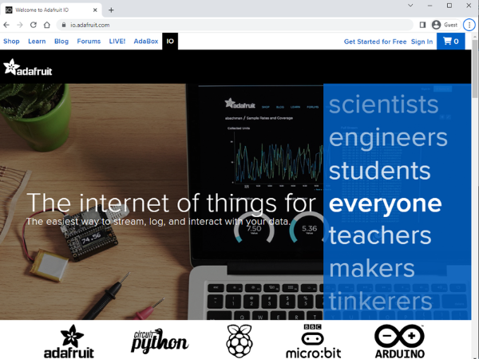

You can get started at [io.adafruit.com](https://io.adafruit.com/). From here you will need to set up an Adafruit account in order to make use of AdafruitIO. Select "Get Started for Free".

### Setting up an Account
You will then need to enter your:
- **First name**.
- **Last name**.
- **Email** - you can use your university or personal email for this.
- **Username** - make it memorable, you'll be typing it out a lot.
- **Password** - make it something unique, don't use an old password.

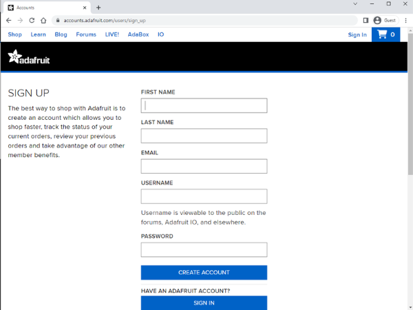

Once you have created your account, it is worth verifying your email address. Without this we won’t be able to use some of AdafriotIO's features later down the line.

From here, you can select IO from the tab at the top of the page.


This will direct you to your AdafruitIO console. It is worth taking note of a few of these tabs:

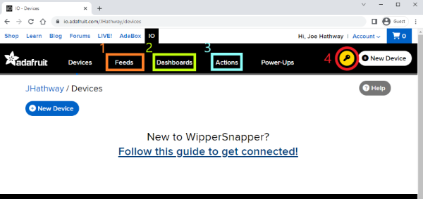

1. Feeds - you will need feeds to send data to/retrieve data from.
2. Dashboards - dashboards allow you to set up widgets and create a UI to visualize data from your feeds. Setting up a dashboard is optional, so we will look at these [later](#creating-a-dashboard).
3. Actions - actions can be set up to react to data received/sent from a feed. Again, these are optional, so we will look at them [later](#actions).
4. **Key** - this will show you your account credentials including your username and IO key. This will be important when setting up the Arduino code.

### Creating a Feed
In order to send and receive information, you will need to create a feed to host the data. First navigate to the "Feeds" tab, and from there, select "New Feed".

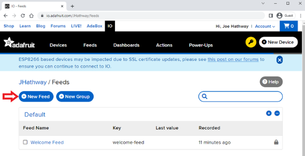

You can then give the feed a name and short description.

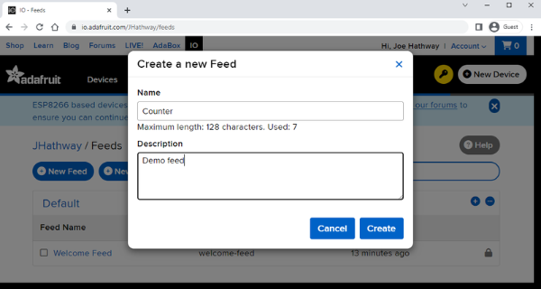

Once created, you can open the feed and you will hopefully see a graph and as well as a data stream below. 

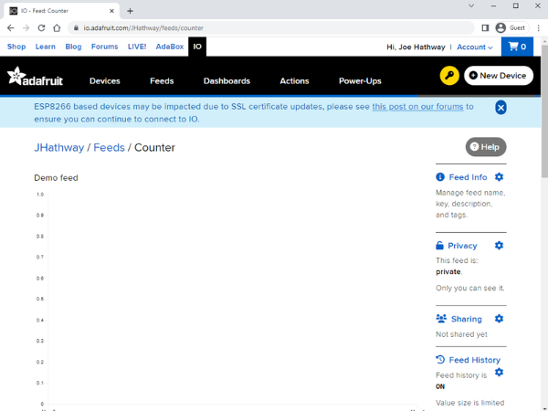

This is where we will send/receive data from the M5Stick, but we can also manually add data to the feed from here if we want.

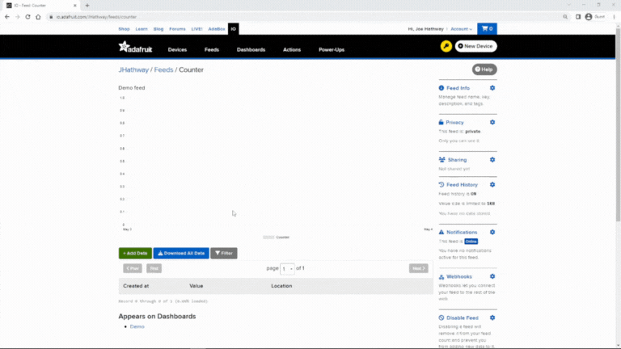

Now you should be ready to send data from the M5Stick.

## Usage
### AdafruitIO Library
Adafruit has created a library that contains code for sending/receiving data to Adafruit. You will need to install this library in your IDE.

**Note**: unfortunately, as of May 2023, Adafruit has released an update to their library that causes an error when compiled. This means you will have to (for the time being) install an older version of the library.

First, navigate to the library manager and search for "Adafruit IO Arduino". 

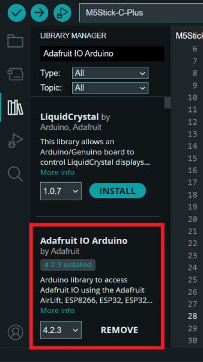

Make sure that you select version 4.2.3 from the dropdown menu, and select *INSTALL*. If you are asked to install extra dependencies, select *INSTALL ALL*.

With these steps done, you should be ready to code.

### Connecting to AIO
Whether you want to send or receive data, you will first need to connect to the AIO server, and then to your chosen feed. The following code will need to be present in **ALL** of your AIO projects.

First, make sure the relevant libraries are included at the top of the sketch.

``` cpp
#include <M5StickCPlus.h>
#include <AdafruitIO_WiFi.h>
```

The AIO library then provides us with some objects that need setup in the global variable space, before the <code>setup()</code> function. 

``` cpp
AdafruitIO_WiFi io("aio_username", "aio_key", "wifi_name", "wifi_password");
```

The <code>AdafruitIO_WiFi</code> object is used to connect to your Adafruit account. You will need to pass it your WiFi details and AdafruitIO account credentials as parameters. Your account credentials can be found in your AdafruitIO console by clicking on the key icon.


**IMPORTANT**: These details allow you to make changes to your Adafruit account, feeds, dashboards, etc. Make sure your AIO Key is kept as safe as any password.

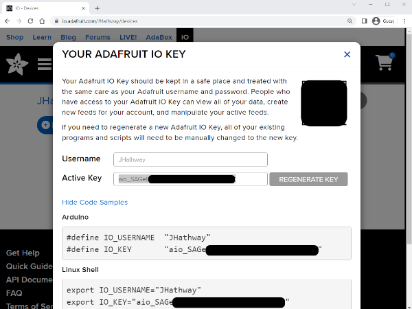

The <code>AdafruitIO_Feed</code> object is used to connect to a specific feed. You will need to pass it the name of the feed you are communicating with. Make sure it is spelled correctly, including spaces and capital letters.

``` cpp
AdafruitIO_Feed *myFeed = io.feed("feed_name");
```

Inside the <code>setup()</code> function, make sure to begin the M5Stick, and then connect to AIO using the <code>io.connect()</code> function.

``` cpp
M5.begin();
io.connect();
```

You can then use a while() loop to wait until you have connected. If your M5Stick does not connect when you upload your code, make sure you have entered your WiFi and AIO credentials correctly.

``` cpp
while (io.status() < AIO_CONNECTED) {
    M5.Lcd.print(".");
    delay(300);
}

// print status to LCD
M5.Lcd.println();
M5.Lcd.println(io.statusText());
```

You will then need to add <code>io.run();</code> at the top of your <code>loop()</code> function:

``` cpp
void loop() {
  io.run();

  ...
```

This ensures that your device remains connected and will receive and send data correctly.

### Publish to Feed
*Example sketch can be found in the examples folder*

"Publishing" is just the word AdafruitIO uses to refer to sending data from your device to a feed.

To publish to one of your feeds, make sure you have the followed the steps outlined in [Connecting to AIO](#connecting-to-aio), and simply use the function <code>myFeed->save("Hello")</code>.

I would recommend sending data of type <code>int</code>, <code>float</code> or <code>String</code> for the best performance.

``` cpp
myFeed->save(1); // int
myFeed->save(0.5); // float
myFeed->save("Hello World"); // String
```

### Subscribe from Feed
*Example sketch can be found in the examples folder*

AdafruitIO uses the word "Subscribing" as a term for retrieving data from a feed.

To subscribe from a feed, firstly make sure you have the followed the steps outlined in [Connecting to AIO](#connecting-to-aio). You will then need to create a callback function. This function will be called every time a message is received from AIO.

For this example, we will just print the incoming data to the LCD screen. 

``` cpp
void handleMessage(AdafruitIO_Data *data) {
  // print data to LCD
  M5.Lcd.print("received <- ");
  M5.Lcd.println(data->value());
}
```

Data is received through the <code>data->value()</code> function. Incoming data is received as a string, so if you wanted to store it as a variabes, you would need to create a String variable.

``` cpp
String incomingData = data->value();
```

After setting up the callback function, you can then pass it to the feed object inside the <code>setup()</code> function.

``` cpp
void setup() {
    // init M5Stick
    M5.begin();

    // connect to AIO
    M5.Lcd.print("Connecting to Adafruit IO");
    io.connect();

    // wait for connection
    while (io.status() < AIO_CONNECTED) {
        M5.Lcd.print(".");
        delay(300);
    }

    M5.Lcd.println(io.statusText());

    // init callback function on message received
    myFeed->onMessage(handleMessage);
    myFeed->get();
}
```

## Additional Features
As well as being able to log and retrieve data, AdafruitIO gives us the option to visualize that data in a couple of different ways.

Dashboards enable you to create a custom UI to display data from your feeds, while actions can send you notifications if the data in your feed meets a certain condition.

Let's have a look at setting up one of each...

### Creating a Dashboard
To create a Dashboard, navigate to the Dashboard tab and select "New Dashboard".

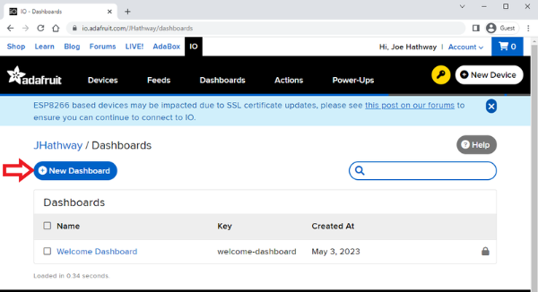

From here, you can give the Dashboard a name and description.

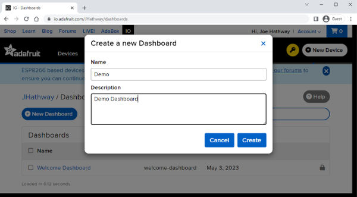

Adafruit will then give you the option of creating a "block". Each block can be thought of as a widget that allows you to interact with a feed in a different way.

This includes:
- toggle switches.
- momentary buttons.
- sliders.
- guages.
- text boxes.
- data streams.
- images.
- line charts.
- color pickers.
- maps.
- remote control/number pads.
- icons.
- indicator lights.
- battery guages.

You can use these blocks to customize your dashboard. 

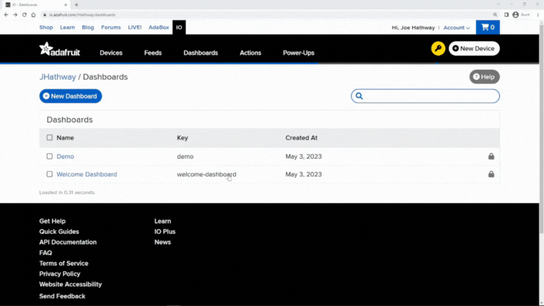

For this example, let's create a line chart that will display the Counter feed.

Once you select your block of choice, AdafruitIO will give you some options for which feed to read from and how you would like the data to be displayed. Make sure to select the correct feed from the menu.

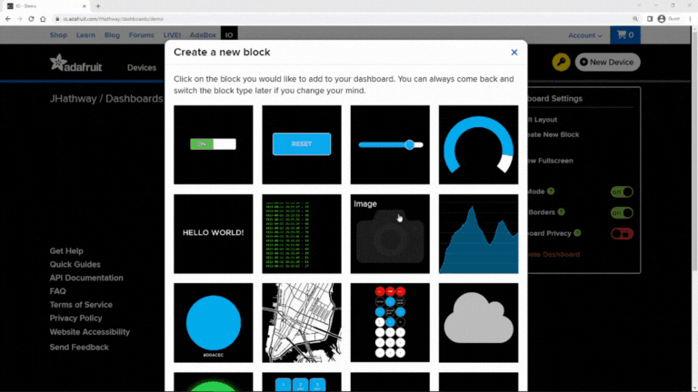

And there you have it. A UI that displays the data from a given feed.

### Actions
To set up a new action, navigate to the Actions tab and select "New Action".

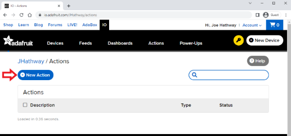

Select "Reactive". You will then be given the option of what type of action you want to create. You have the option of:

- Reactive - action is triggered by the daa in a feed (e.g. if data reches a certain value).
- Scheduled - perform an action at a scheduled time.
- Timer - perform an action a set amount of time after the feed is updated.

For this example, let's create a reactive action that will email you when your feed reaches a certain value. **Note**: make sure you have verified your email address for this to work.

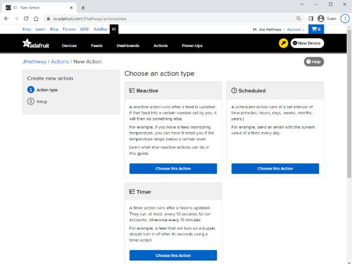

You will be given a series of dropdown menus:

- <code>if</code> - select the correct feed.
- <code>is</code> - select a comparison and set the comparison value to something appropriate (>10 in this example). 
- <code>then</code> - you have some options here of what will happen when the condition is met ("email me" for this example).
- <code>Subject</code> & <code>Body</code> - enter the message you want to send.
- <code>Limit Every</code> - this will make sure you only get emailed once every so often (15mins for this example). 

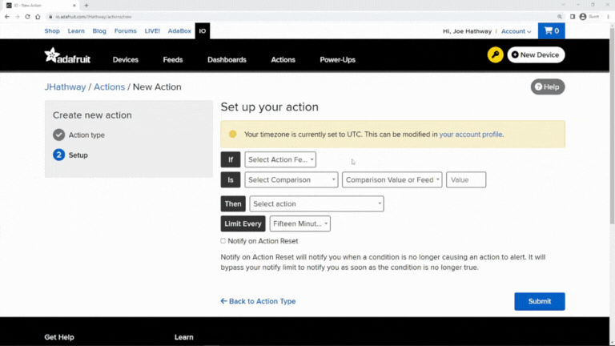

You can then select "Submit" and your action will be created.

To test this, manually add the number 11 to your chosen feed ([described here](#creating-a-feed)) and you should hopefully receive your email notification within a few seconds.


