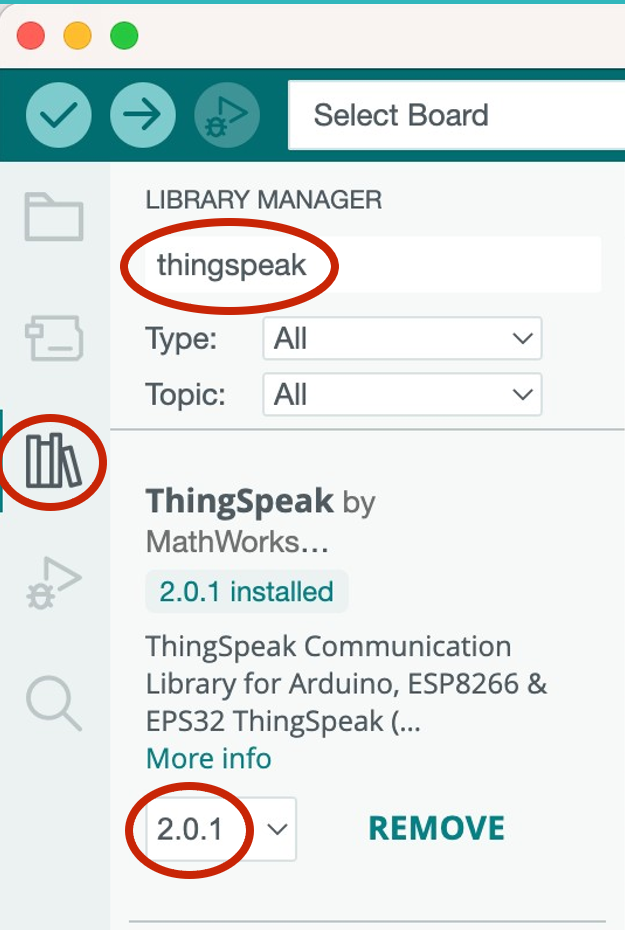
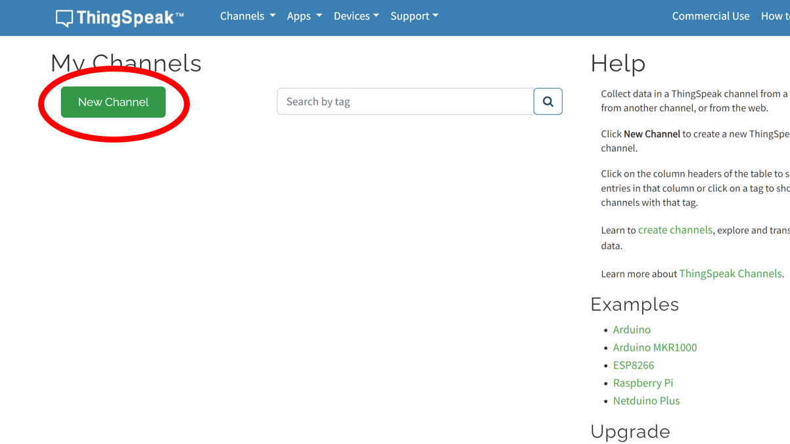
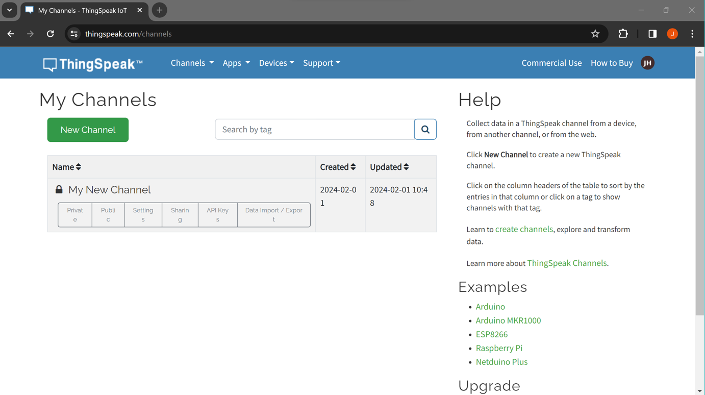
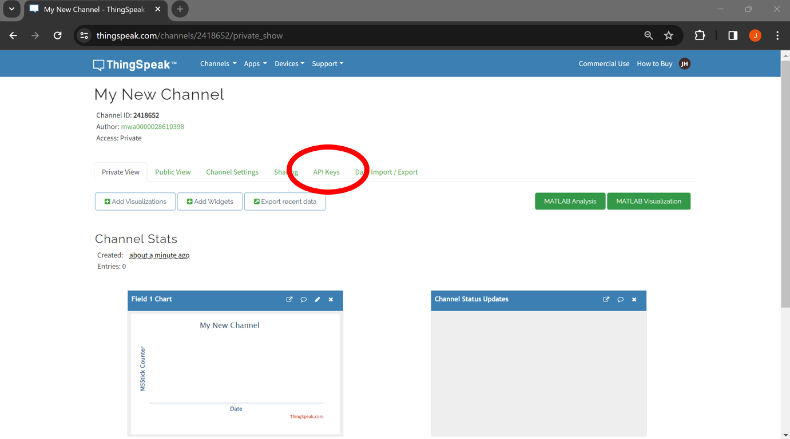
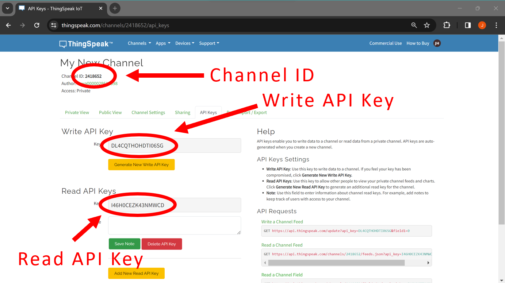
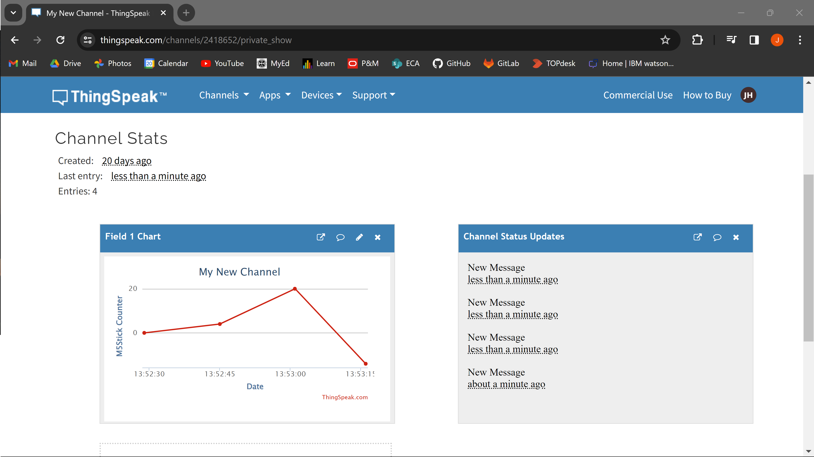

# Connecting to ThingSpeak from an M5StickC Plus


## Contents

- [Introduction](#introduction)
- [SettingUp](#setting-up)
    - [ThingSpeak Library](#installing-the-thingspeak-library)
    - [ThingSpeak Account](#creating-a-thingspeak-account)
    - [ThingSpeak Channel](#create-a-channel)
    - [API Keys](#api-keys)
- [Usage](#usage)
    - [Send](#sending-to-thingspeak)
    - [Receive](#receiving-from-thingspeak)

## Introduction
[ThingSpeak](https://thingspeak.com/) is an Internet of Things (IoT) cloud service created by MathWorks that allows users to collect, store, analyze, and visualize data. By communicating with the ThingSpeak API your M5Stick can send/receive data wirelessly to/from a ThingSpeak channel. 

This can be useful for sending data wirelessly from one device to another device in a completely different location. As long as your device has a secure Internet connection, you can send and receive data from anywhere in the world.

Once you have set up a free MathWorks account, you can start sending and receiving data to/from channels on your ThingSpeak account. The channel will also plot a real-time graph of the data it receives for you to view online.

## Setting Up
### Installing the ThingSpeak Library
MathWorks have created an Arduino library to more easily connect to, send to and receive from your ThingSpeak channels. You will need to install this in the Arduino IDE's library manager.



1. Open the Arduino IDE.
2. Open the library manager.
3. Search for *“ThingSpeak”*.
4. Make sure you have selected the most recent version.
5. Click *Install*.

### Creating a ThingSpeak Account
Before you can start sending data to ThingSpeak, you will need to create a MathWorks account. To get started:

1. Register an account at [mathworks.com](https://uk.mathworks.com/mwaccount/register). 
2. Log into [thingspeak.com/login](https://thingspeak.com/login).

ThingSpeak is a free service but does limit you to sending/receiving data every 15 seconds. Any requests sent under 15 seconds from the last will be ignored. 

### Create a Channel
You will need to create a channel to host the data you are sending. You can have multiple channels on your account set up for different projects, and each channel can receive, store and visualise data sent from your M5Stick - or another IoT device.

Once you have logged onto ThingSpeak.com, navigate to the taskbar at the top of the page and click *Channels → My Channels*. This page will display all of your active channels, but since we haven't created a channel yet, this page should be empty.

To create a channel, click *New Channel*.



This should take you to a page with lots of empty fields for you to fill in. Most of these are likely not important to us (at least not yet), but there are a few you will need to make sure are filled in:

- **Name** - this is what you want your channel to be called. If this is your first channel, you call this something like “My New Channel”, although more descriptive names are encouraged.

- **Field 1** - This is a label for the type of data you are sending to this channel. For instance, you may want to send temperature data to your channel, in which case you can name the field “Temperature”. You also have the option of creating more than one field. This could be for if you wanted to send multiple types of data to the same channel to compare them (e.g. temperature and humidity data).

- **Show Status** - make sure you have ticked this box at the bottom of the page.
 

You can then save the channel. If you now navigate to *Channels → My Channels*, you should see your newly created channel.



You can now click on the channel to see the channel details and data.

### API Keys
To access your channel remotely you will need the channel API keys. ThingSpeak will only allow requests with a correct API key to send or receive data from a channel. As such, it is not only important to know how to find the API keys, but also to keep them private and not share them.

To find the API keys for your channel, click on the channel from *Channels → My Channels* and select *API Keys*.



We will need some of these details for our code so take note of the: 

- **Channel ID number**.
- **Write API Key** - for sending data to the channel.
- **Read API Key** - for reading data from the channel.



Remember, keep these keys safe and private.

## Usage
To send or receive data to/from ThingSpeak, you will need to include the relevant libraries at the top of your project sketch. 

We should also store our Wi-Fi and account information as variables to use later in the sketch. 

Finally, we need to create an instance of the <code>WiFiClient</code> class to pass to the <code>ThingSpeak</code> class.

``` cpp
#include <M5StickCPlus.h>
#include <ThingSpeak.h>
#include <WiFi.h>
  
//==========================================
// ***CHANGE THESE VARIABLES***
// WiFi details
const char* network = "YourWifiName";
const char* password = "YourWifiPassword";
  
// ThingSpeak channel details
unsigned long channelNumber = 1234567;
const char* APIKey = "ABCDEFGHIJKLM"; // make sure this is correct for read/write access
//==========================================

WiFiClient client;
```

Inside the <code>setup()</code> function, we first need to [connect to the Wi-Fi network](/examples/Wireless-Communication/Wi-Fi/README.md). We can then initialize the ThingSpeak client.

``` cpp
void setup() {
  M5.begin();
  
  // Connect to WiFi
  M5.Lcd.print(Connecting)
  WiFi.mode(WIFI_STA);
  WiFi.begin(network, password);
  
  // while not connected to WiFi AND before timeout
  while (WiFi.status() != WL_CONNECTED) {
    M5.Lcd.print(".");
    delay(400);
  }
  
  M5.Lcd.println();
  M5.Lcd.println("Connected");

  // Start ThingSpeak client
  ThingSpeak.begin(client);
}
```


### Sending to ThingSpeak
To send data to a ThingSpeak channel, we simply need to:

1. Set a message status.
2. Set the field we want to send to.
3. Publish the message.

To set the message, we can use <code>ThingSpeak.setStatus()</code> and pass the status as a String argument.

``` cpp
ThingSpeak.setStatus("New Message");
```

To set the field, we can use <code>ThingSpeak.setField()</code> which takes two arguments: the index of the field, and the data we are sending. If we are sending to a ThingSpeak channel with one field, we can simply pass <code>1</code> as the field index.

``` cpp
int data = 1234; // data to send
ThingSpeak.setField(1, data); // set the field
```

Finally, to publish this to ThingSpeak, we use <code>ThingSpeak.writeFields()</code>, passing the channel ID and write API key as arguments. 

**Important:** make sure this is the **write** API key.

``` cpp
ThingSpeak.writeFields(channelNumber, APIKey);
```

Once you have uploaded the sketch, press the home button on your M5Stick look at your ThingSpeak channel. The data should match the number on the M5Stick's screen and the status message should appear on your ThingSpeak channel in the Channel Status Updates window.



### Receiving from ThingSpeak
To receive data from ThingSpeak, we can use <code>ThingSpeak.readMultipleFields()</code> which takes the channel ID and read API key as arguments.

**Important:** make sure this is the **read** API key.

This method returns an integer that tells us if we were able to receive the data successfully. If we receive the status message <code>200</code> we know that we have successfully read the data from ThingSpeak channel.

``` cpp
int statusCode = ThingSpeak.readMultipleFields(channelNumber, APIKey);
```

We can then retrieve the status message and field data.

``` cpp
String statusMessage = ThingSpeak.getStatus(); 
int incomingValue = ThingSpeak.readIntField(channelNumber, 1, APIKey);
```

We can then use this information later in our code.

Once you have uploaded the sketch, you should see the M5Stick print the most recent data from the ThingSpeak channel to its LCD screen. You can check if it is correct by viewing the graph on your ThingSpeak channel. 

Note that the value it is reading will only change if ThingSpeak receives new data.