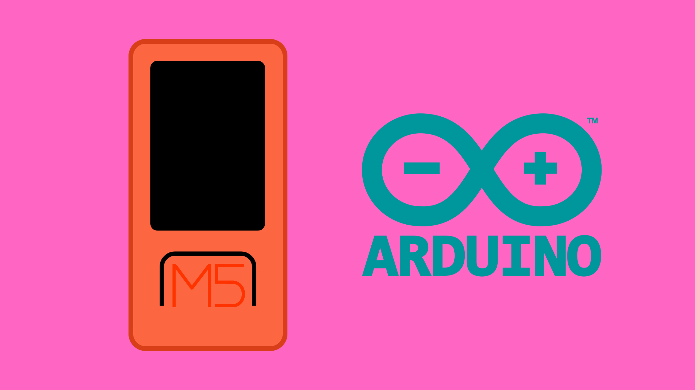
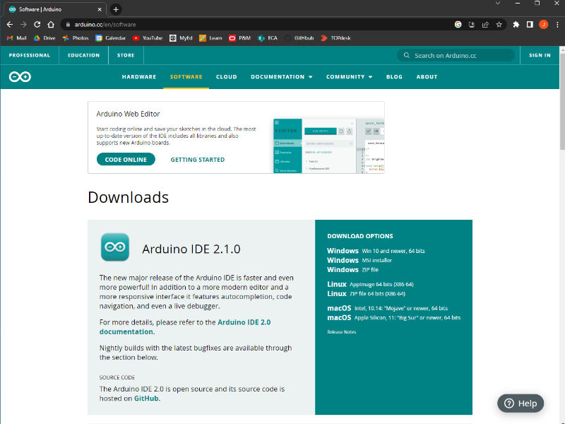
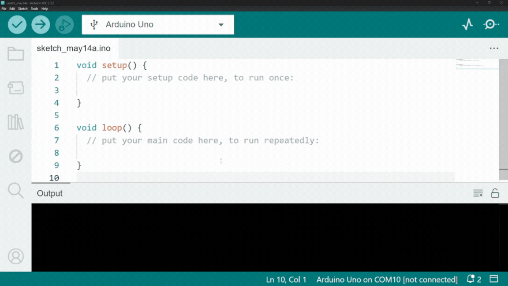
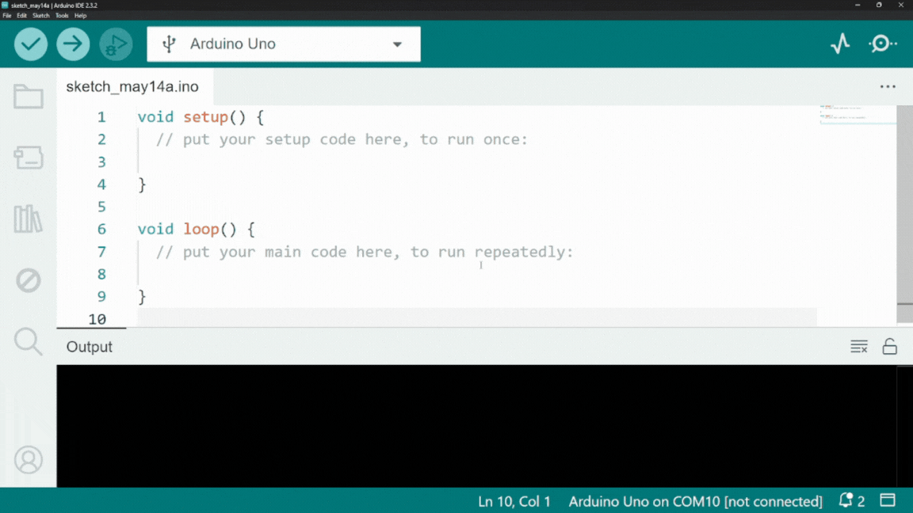
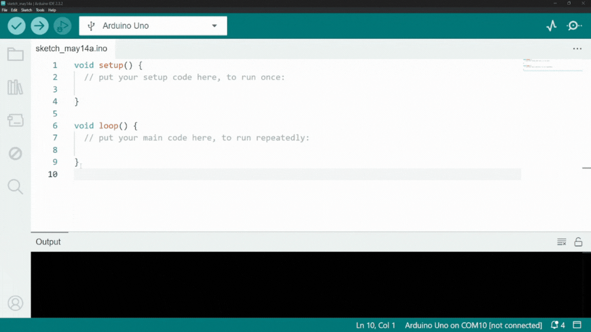
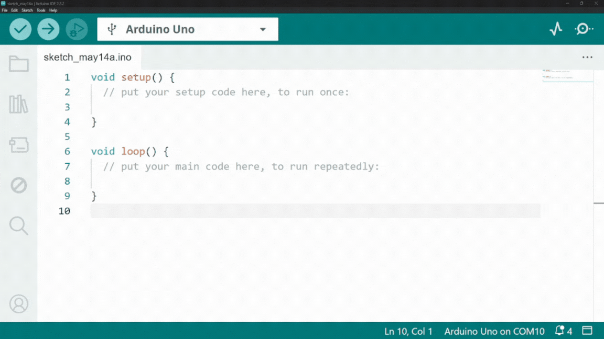

# Programming the M5StickC Plus from the Arduino IDE



## Contents

- [The Arduino IDE](#the-arduino-ide)
    - [System Requirements & Dependencies](#system-requirements--dependencies)
- [Setup](#setup)
    - [1. Download IDE](#1-download-the-ide)
    - [2. Board Manager](#2-boards-manager)
    - [3. M5StickC Plus Library](#3-library-manager)
    - [Uploading code](#uploading-code)
- [Hello World](#hello-world)
    - [Code](#code)
    - [How it works](#how-it-works)
- [Troubleshooting](#troubleshooting)

## The Arduino IDE
The [Arduino IDE](https://www.arduino.cc/) is an easy-to-use programming environment, and for those of you who have previous programming experience with Arduino, it may be a familiar interface to navigate. Even for beginners, however, the Arduino IDE has a simple layout and can be quite easy to get to grips with - especially since the release of Arduino IDE 2.0.

To use the Arduino IDE for M5StickC Plus programming, you will need to:

1. [Install the Arduino IDE](#1-download-the-ide).
2. [Install the M5Stack board manager](#2-boards-manager).
3. [Install M5StickC Plus Arduino library](#3-library-manager).

You will only need to do this once and you will be ready to go.

In this tutorial, we will look at how to install and set it up to program M5StickC Plus boards. You can also choose to watch [this video walkthrough](https://media.ed.ac.uk/media/Programming%20M5StickC%20Plus%20with%20Arduino%20IDE%202.0/1_uysgibv8) (internal UoE use only).

### System Requirements & Dependencies
To install and run the Arduino IDE 2.x (newest version), it is recommended that you use a computer that runs:

- Windows 10 or newer.
- macOS 10.15 “Catalina” or newer.
 
At least 2GB of RAM is also recommended, and the download (plus packages/libraries) requires about 400MB of storage space.

The M5Stack board manager that we need to install also requires Python to be installed on your device. To check if you have already Python installed, and for how to install it, you can go to [this page](https://www.datacamp.com/blog/how-to-install-python). 

**Important:** Mac users do NOT need to install Xcode in order to use the Arduino IDE or M5Stack board manager. You may be prompted to download it, however it is a very large download and not necessary.

## Setup
### 1. Download the IDE


To start using the Arduino IDE to program your M5StickC Plus board, you will first need to install it on the computer you are working on. You can [download the Arduino IDE for free from their website](https://www.arduino.cc/en/software).  

The download is free, but you may be prompted to donate to Arduino. If you don't want to do this, simply click *Just Download* to proceed without donating. You may also be prompted to sign up for the Arduino newsletter. Again, you can skip this step by clicking *Just Download*.

### 2. Boards Manager
After installing the Arduino IDE, we also need to download the M5Stack board manager. This provides the Arduino IDE the required tools and instructions for uploading code to M5Stack boards. 

By default, the M5Stack board manager is not directly available from the IDE Boards Manager tab, so instead we have to direct the IDE to an additional URL in order to access the "instructions" for that board.

To access the additional Boards Manager, navigate to the IDE preferences:

- **Windows:** *File → Preferences*
- **Mac:** *Arduino → Preferences*

Copy and paste this link into the text box next to Additional Boards Manager URLs (you may need to scroll down):

```
https://m5stack.oss-cn-shenzhen.aliyuncs.com/resource/arduino/package_m5stack_index.json
```



A message box should appear displaying the message *“Downloading index: package_m5stack_index.json”*. Wait until this download has completed before proceeding.

Finally, you can now navigate to the Boards Manager tab on the sidebar of the IDE. This should be the icon that looks like an Arduino board. From there, search for *“M5Stack”* and install the M5Stack Board Manager by M5Stack.



This may take a few minutes to install.

**Important:** Again, Mac users do NOT need to install Xcode in order to use the Arduino IDE or M5Stack board manager. You may be prompted to download it, however it is a very large download and not necessary.

### 3. Library Manager
The last thing we need to install is the M5StickC Plus Arduino library. A library is a file (or files) that contains pre-written code that we can include in our own code. In the case of the M5StickC Plus, M5Stack has provided a very useful library that includes code that makes it very easy to use the onboard components - like the buttons and LCD display.

To install the library, navigate to the library tab (the icon that looks like a row of books) or go to *Sketch → Include Libraries → Manage Libraries*. From here, search for *“M5StickCPlus”* and install the M5StickC Plus Library by M5Stack.
 
If prompted to install other dependencies, select *INSTALL All*.



You should now be ready to start programming!

### Uploading Code
To check that everything is working properly, it is worth just uploading an empty sketch (code file) to the M5Stick. If you have missed any of the previous steps, or if anything else is wrong, the IDE should tell you when you go try to upload some code.

First, you need to tell the IDE what board you are using and which USB port it is connected to. To do this, navigate to the* Select Board and Port* menu. This is the dropdown menu at the top of the IDE. From there, *click Select other board and port…*

You will need to search for *“M5StickCPlus”* and select it. This should now display a tick next to *M5StickCPlus* to confirm this choice.

You will also need to select the correct USB port. This is usually the one with *(USB)* marked next to it. Again, a tick should show you that you have selected this port. You can now click *OK*.



You can now press the upload button. This is the icon with the right-facing arrow in the top left of the IDE.

This will cause the IDE to compile the code into machine code, and then upload it to the (now selected) M5StickC Plus board. The IDE will display a message to tell you if the compile/upload was successful.

## Hello World
To get started programming the M5StickC-Plus, a simple "Hello World" sketch might be a nice place to start.

### Code
You can copy and paste this code into a new sketch and upload it to your M5STickC Plus.

``` cpp
#include <M5StickCPlus.h>

void setup() {
    M5.begin();

    M5.Lcd.print("Hello World");
}

void loop() {}
```

### How it works
First of all, for every M5StickC Plus project, you should include the M5StickC Plus library at the top of the code. This gives us access to code for controlling the onboard components on the M5StickC Plus board. 

``` cpp
#include <M5StickCPlus.h>
```

You should also include the <code>M5.begin()</code> function inside the <code>setup()</code> function. This will initialize all of the onboard components (LCD, buttons, IMU etc).

``` cpp
void setup() {
    M5.begin();
...
```

Finally, to print text to the LCD, we can use the <code>M5.Lcd.print()</code> function given to us by the M5StickCPlus library. Here we will simply print the text "Hello World".

``` cpp
...
    M5.Lcd.print("Hello World");
}
```

If successful, this should print out the words "Hello World" to the LCD display on your M5Stick.

## Troubleshooting

### M5Stick not recognized by the IDE

1. Is the USB connection to your computer secure and stable? 
    - Try again using another cable.
    - Try again using another USB port on your computer.
    - If you are using a USB-C adapter, try again using a different one.

2. Have you correctly installed the M5Stack boards manager?
    - Open the [Board Manager](#2-boards-manager) and check if the M5Stack boards manager is installed.
    - Check if the M5Stack boards manager up-to-date.

3. Do you have the correct USB drivers installed?
    - If your computer still does not recognize your M5Stick, you may need to install the CP210x drivers.
    - [Windows Drivers](https://www.silabs.com/developer-tools/usb-to-uart-bridge-vcp-drivers?tab=downloads): select "*CP210x Windows Drivers*".
    - [Mac OSX Drivers](https://www.silabs.com/developer-tools/usb-to-uart-bridge-vcp-drivers?tab=downloads): select "*CP210x VCP Mac OSX Driver*".
    - Close the Arduino IDE and open it again.
    - If this doesn't work, you may need to restart your computer.

### Compilation Error

1. Are there any syntax errors in your code?
    - Check for any spelling errors and typos.
    - Check for any missing semicolons <code>;</code>.
    - Check for any missing closing bracket (all open brackets must have a matching closing bracket later in the code).

2. Have you linked to the correct libraries properly?
    - Check that you have [installed the M5StickCPlus library](#3-library-manager) properly.
    - Make sure you have included the library at the top of your sketch by using <code>#include <M5StickCPlus.h></code>.

3. Have you selected the correct board?
    - Make sure that you have selected the M5StickCPlus board from the [Boards and Port manager](#uploading-code).

### Upload Error

1. Is the M5Stick powered on?
    - Hold the power button on the left side of the M5Stick down for at least 2 seconds (the screen may or may not turn on depending on what code it is currently running).
    - Try uploading the code again.

2. Have you selected the correct board and port?
    - Make sure that you have selected the M5StickCPlus board from the [Boards and Port manager](#uploading-code).
    - Make sure that you have selected the port with *(USB)* written next to it from the [Boards and Port manager](#uploading-code).
    - If there are no ports marked *(USB)*, follow the instructions for when the [IDE does not recognize the M5Stick](#m5stick-not-recognised-by-the-ide).

3. Do you have Python installed?
    - On some MacOS devices you may need to install Python for the M5Stack board manager to work properly.
    - Install Python from [Python.org](https://www.python.org/downloads/).
    - Close the Arduino IDE and open it again.