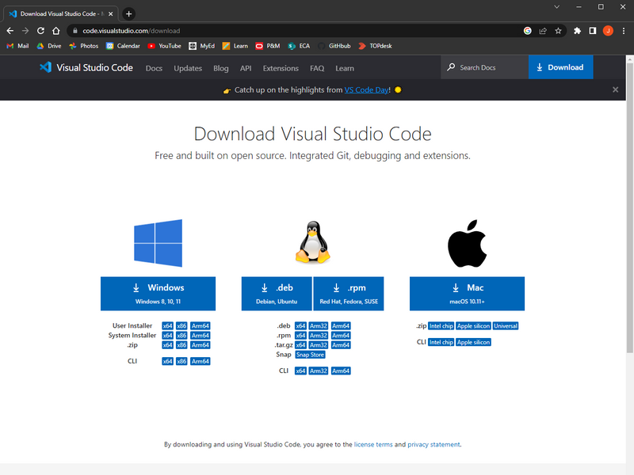
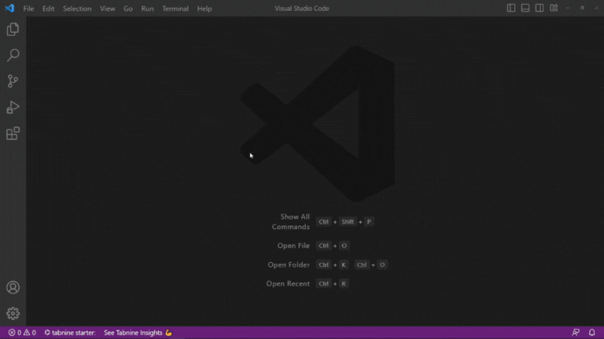
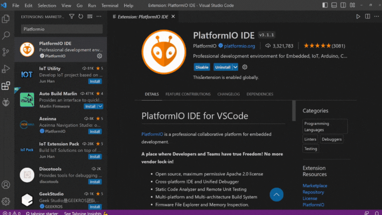
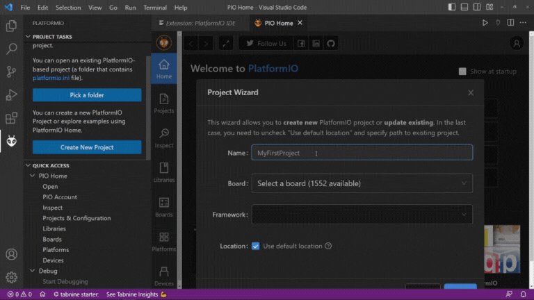
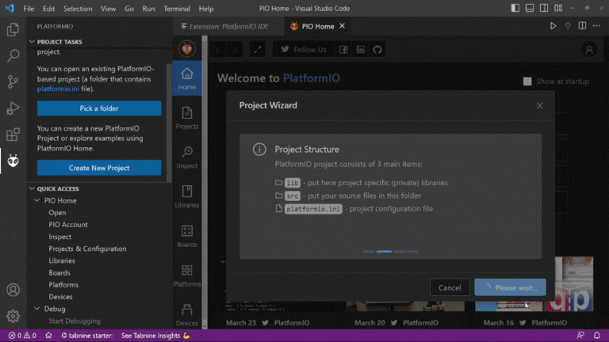
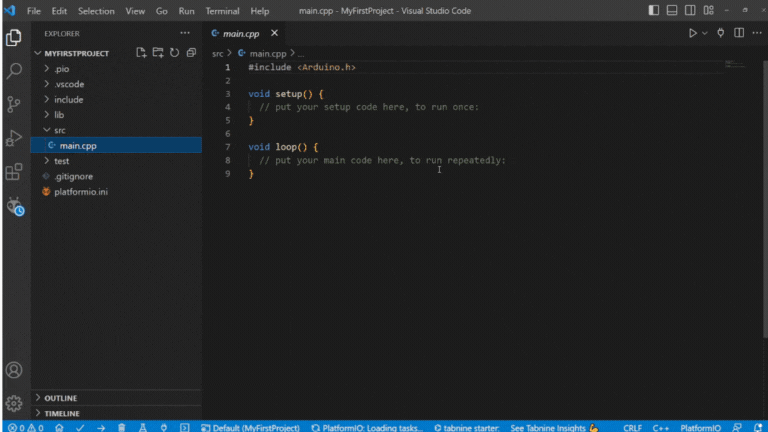
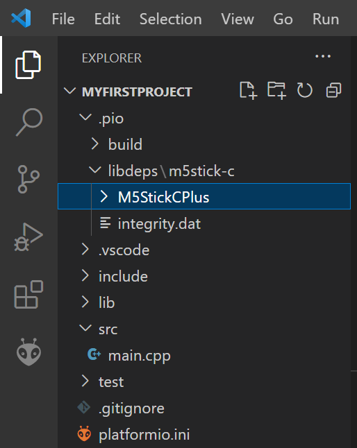
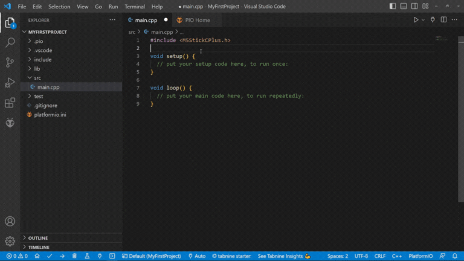

# Programming the M5StickC Plus from PlatformIO


## Contents

- [PlatformIO](#platformio)
    - [System Requirements & Dependencies](#system-requirements--dependencies)
- [Setup](#setup)
    - [1. Install VS Code](#1-install-vs-code)
    - [2. Install PlatformIO Extension](#2-install-platformio-extension)
    - [3. Create a New Project](#3-create-a-new-project)
        - [Open an Existing Project](#open-existing-projects)
    - [4. Install Libraries](#4-install-libraries)
- [Hello World](#hello-world)
    - [Code](#code)
    - [How it Works](#how-it-works)

## PlatformIO
The [Arduino IDE](../ArduinoIDE_Setup/README.md) is a solid choice for beginners and those who prefer a simpler, more streamlined development experience. However, for larger project and for those who want more programming tools, there is another option for programming M5StickC Plus boards.

[PlatformIO](https://platformio.org/) is a [VS Code](https://code.visualstudio.com/) extension designed for programming hundreds of different electronics development boards. VS Code itself is a lightweight code editing software that allows you to install all kinds of extensions that can help you with debugging, autocompletion, version control and formatting among many, many other things.

To start using the PlatformIO for M5StickC Plus programming, you will need to:

1. Install VS Code.
2. Install the PlatformIO extension.
3. Create a PlatformIO M5StickC Plus project.
4. Install the M5StickC Plus Arduino library to your new project.

Bear in mind, steps 1 and 2 only need to be done once. Steps 3 and 4 will need to be carried out for every new project you want to create.

In this tutorial, we will look at how to install and set it up to program M5StickC Plus boards. You can also choose to watch [this video walkthrough](https://media.ed.ac.uk/media/Programming%20M5StickC%20Plus%20with%20PlatformIO/1_chpql4of) (internal UoE use only).

### System Requirements & Dependencies

To install and run the VS Code, it is recommended that you use a computer that runs: 

- Windows 10 and 11 (64-bit).
- macOS versions with Apple security update support. This is typically the latest release and the two previous versions.
 
At least 1GB of RAM is also recommended, and the download (plus extensions) requires about 400MB of storage space. 

PlatformIO also requires Python to be installed on your device. To check if you have already Python installed, and for how to install it, you can go to [this page](https://www.datacamp.com/blog/how-to-install-python).

## Setup
### 1. Install VS Code


You will need to install VS Code from https://code.visualstudio.com/download. Make sure to select correct download link for your computer's operating system. 

From there, follow the instructions to finish the download and install.

### 2. Install PlatformIO Extension
Once VS Code is installed, open the application. You can then navigate to the *Extensions* tab on the left-hand side of the screen. From there you can search for *“PlatformIO”* and install it. 



You should now be ready to start programming!

### 3. Create a New Project
Workflow on PlatformIO works slightly differently to the Arduino IDE. A PlatformIO project folder will contain everything needed to compile and upload code to your chosen board. This includes all libraries and dependencies and config files for VS Code and PlatformIO. This is all packaged in the same directory to make it easier to keep track of large projects.

To see this in action, you will need to make a new project. You can do this by navigating to the new PlatformIO icon on the sidebar. This should look like an ant/insect head:


Open the tab and select either *Create New Project* or *Open*. From here you can create a new project and give it a name.



You will also need to select the board you are using from the dropdown menu. Make sure 'Framework' is set to 'Arduino' and create the project. By default, it will saved to the 'PlatformIO' folder inside your Documents.



After it has finished, you will be shown your new project workspace. If you open the file explorer from the side bar (the icon that looks like sheets of paper) you will be able to see the project structure. This should include the following:

- **.pio folder** - libraries will be stored in here when installed.
- **.vscode folder** - VS Code config files are stored here.
- **include folder** - empty by default.
- **lib folder** - empty by default.
- **src folder** - where your source files are stored.
- **test folder** - empty by default.
- **.gitignore file** - for git repos (files to be ignored by git).
- **platformio.ini** - PlatformIO config file.

As you can see, there are quite a few folders and files here, but only a couple of them are of particular interest to us most of the time. In fact, most of the time you will just be editing the main.cpp file inside the src folder.



#### Open Existing Projects
Before looking at how to upload code, it is important to know how to open an existing project.

To open a pre-existing project:

- Open VS Code.
- Navigate to *File → Open Folder*.
- Select the project folder (not the platformio.ini file!).
- Select *Open*.
 
It may take a few moments for PlatformIO to initialise, but after that you will be good to go.

#### 4. Install Libraries
A library is a file (or files) that contains prewritten code that we can include in our own code. In the case of the M5StickC Plus, M5Stack has provided a very useful library that includes code that makes it very easy to use the onboard components - like the buttons and LCD display. 

As previously mentioned, a PlatformIO project includes all installed libraries in the .pio folder inside the project folder. This means that - unlike the Arduino IDE - you will have to install the <code>M5StickCPlus.h</code> library (and any other libraries you may need) in every project you want to include it in.

To install a library in a PlatformIO project, navigate to the PlatformIO tab (ant/insect icon) and go to *Libraries*. From here you can search for and select the library you want to install. For now, search for the *“M5StickCPlus”* library by M5Stack.

Select *Add to Project*, select which project you want to install it to, and select *Add*. This may take a few minutes to complete. 



After downloading the library and building your project, you will be able to see it inside the project folder: .pio -> libdeps -> m5stick-c -> M5StickCPlus



#### Uploading Code
Before starting to code your own projects, it is worth uploading an empty sketch to the M5Stick to ensure everything is working correctly.

You can specify the USB port you want to upload to, however this is set to 'Auto' by default and will usually detect the right port.

To upload, select the Upload icon at the bottom-left of the IDE.



## Hello World
To get started programming the M5StickC-Plus, a simple "Hello World" sketch might be a nice place to start.

### Code
You can copy and paste this code into a new sketch and upload it to your M5STickC Plus.

``` cpp
#include <M5StickCPlus.h>

void setup() {
    M5.begin();

    M5.Lcd.print("Hello World");
}

void loop() {}
```

### How it works
First of all, for every M5StickC Plus project, you should include the M5StickC Plus library at the top of the code. This gives us access to code for controlling the onboard components on the M5StickC Plus board. 

``` cpp
#include <M5StickCPlus.h>
```

You should also include the <code>M5.begin()</code> function inside the <code>setup()</code> function. This will initialize all of the onboard components (LCD, buttons, IMU etc).

``` cpp
void setup() {
    M5.begin();
...
```

Finally, to print text to the LCD, we can use the <code>M5.Lcd.print()</code> function given to us by the M5StickCPlus library. Here we will simply print the text "Hello World".

``` cpp
...
    M5.Lcd.print("Hello World");
}
```

If successful, this should print out the words "Hello World" to the LCD display on your M5Stick.