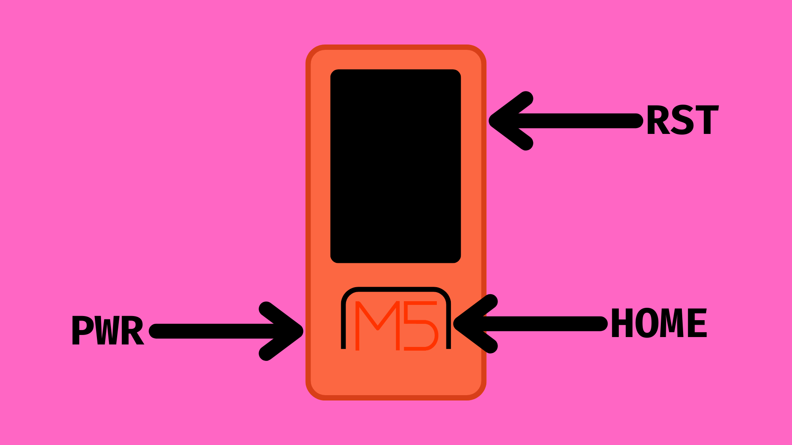

# M5StickC Plus Built-in Buttons



## Contents

- [Introduction](#introduction)
- [Buttons](#buttons)
    - [Power](#power)
    - [Reading Buttons](#reading-button-states)
        - [Raw Button Value](#raw-button-value)
        - [isPressed()](#check-if-button-is-pressed)
        - [pressedFor()](#check-if-button-is-held)

## Introduction
The M5StickC Plus ships with three built-in buttons:

- **HOME (BtnA)** - on the front.
- **RST (BtnB)** - on the right side. 
- **PWR** - on the left side. 

The HOME and RST buttons can be programmed to be used as inputs in our M5StickC Plus projects. The M5StickC Plus library makes this even easier than using breadboarded buttons by providing some useful functions for us to start using them straight out of the gate.

The PWR button is not programmable but can turn the M5Stick on and off.

In this tutorial, we will look at how we can use these functions in our projects.

## Buttons
### Power

- **Power on:** Hold PWR button for 2 seconds
- **Power off:** Hold PWR button for 6 seconds

### Reading button states
The M5StickC Plus library provides functions for more easily reading the state of the HOME and RST buttons on the M5StickC Plus board.

To make use of these functions, we need to include the M5StickC Plus library in the project sketch and the line <code>M5.begin()</code> in the <code>setup()</code> function.

``` cpp
#include <M5StickCPlus.h>

void setup() {
    M5.begin();
}
```

#### Raw Button Value
For reading raw data from the M5StickC Plus buttons, we can use the methods <code>M5.BtnA.read()</code> for the HOME button and <code>M5.BtnB.read()</code> for the RST button. These methods will return the raw button data from each M5Stick button. 

These methods will return <code>0</code> if pressed, or <code>1</code> if not pressed. We can either read this as an integer or boolean (where 0=false and 1=true).

``` cpp
void loop() {
    bool homeReadValue = M5.BtnA.read();
    bool rstReadValue = M5.BtnB.read();
}
```

You can find a full example [here](M5_Buttons_Raw/M5_Buttons_Raw.ino).

#### Check if button is pressed
As well as providing a function for reading the button values, the M5StickC Plus library also gives us functions for checking if they are pressed.

The <code>M5.BtnA.isPressed()</code> method will return a boolean value indicating whether the button is pressed (true) or not (false). In order to use this method, we must first use another method - <code>M5.update()</code> - which will gather the button data and ensure that <code>M5.BtnA.isPressed()</code> will return an up-to-date boolean.

**Important:** <code>M5.BtnA.isPressed()</code> will not update until <code>M5.update()</code> is called. As such we should place th latter at the top of the <code>loop()</code> function before anything else.

``` cpp
void loop() {
    M5.update(); // get button data

    bool homeIsPressed = M5.BtnA.isPressed();
    bool rstIsPressed = M5.BtnB.isPressed();
}
```

You can find a full example sketch [here](M5_Buttons_IsPressed/M5_Buttons_IsPressed.ino).

#### Check if button is held
Another useful method the M5StickC Plus library gives us for reading button presses is the <code>pressedFor()</code> method. This method can check if a button has been held for a defined amount of time.

Again, we need to use the <code>M5.update()</code> method to gather the button data and calculate how long each button has been pressed before calling <code>M5.BtnA.pressedFor()</code>. 

We can then pass the amount of time (in milliseconds) we want to check the button has been held for as an argument - e.g. for 2 seconds we can use <code>M5.BtnA.pressedFor(2000)</code>. This method will return a boolean value indicating whether the button has (true) or hasn't (false) been held for that duration of time or longer.

``` cpp
void loop() {
    M5.update(); // get button data

    bool homeIsHeld = M5.BtnA.pressedFor(2000);
    bool rstIsHeld = M5.BtnB.pressedFor(2000);
}
```

You can find a full example sketch [here](M5_Buttons_IsHeld/M5_Buttons_IsHeld.ino).