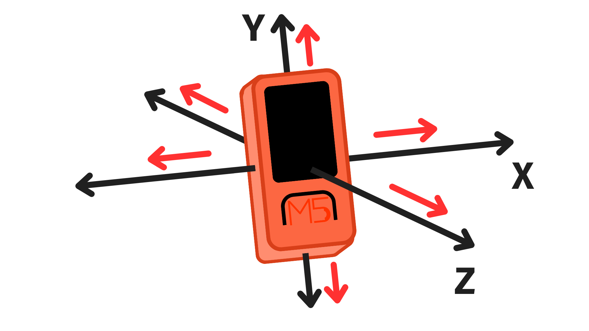
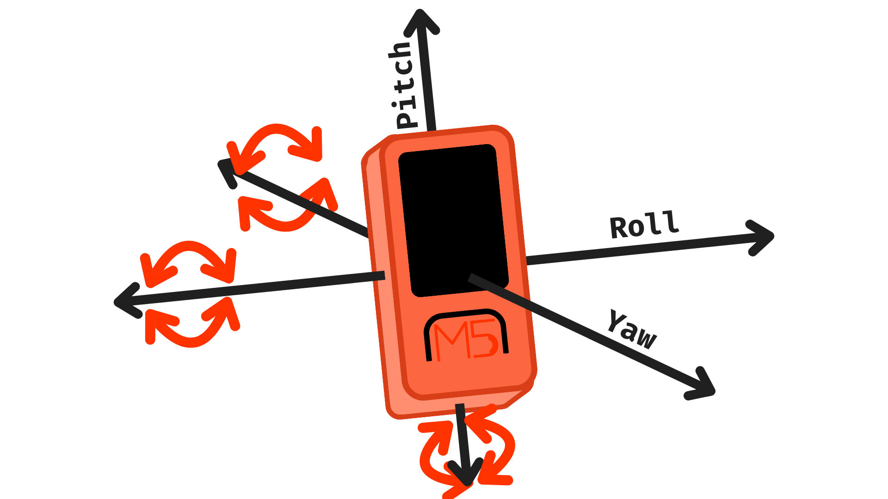
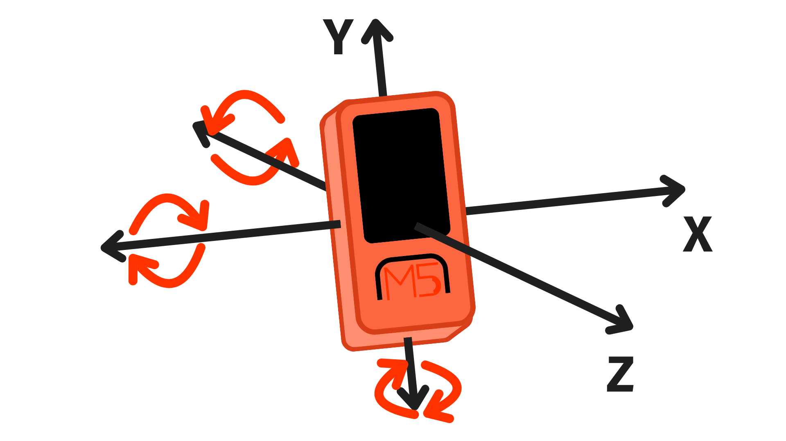

# M5StickC Plus Inertial Measurement Unit (IMU)


## Contents

- [Introduction](#introduction)
- [Reading IMU Data](#reading-imu-data)
  - [Accelerometer](#accelerometer)
  - [AHRS](#ahrs)
  - [Gyroscope](#gyroscope)

## Introduction
An Inertial Measurement Unit (IMU) is an electronic component that contains a combination of accelerometers, gyroscopes, and magnetometers to measure an object's specific force and angular rate.

This is essentially a device that can tell us information about the movement of an object - whether that be its angular position or acceleration.

The M5StickC Plus contains an onboard IMU chip (MPU6886) that can gather data on:

- **Gyroscope events** - rate of rotation around three axis.
- **Accelerometer events** - acceleration on three axis.
- **Attitude and Heading Reference System (AHRS)** - angular position on three axis.

On this page, we will look at how to retrieve information on each of these using classes and methods from the M5StickC Plus library.

## Reading IMU Data
The M5StickC Plus library provides us with several methods for reading and retrieving the IMU data. 

As always when using the onboard components on the M5StickC Plus, the project sketch will need to include the M5StickC Plus library at the top, and <code>M5.begin()</code> inside the <code>setup()</code> function.

We also need to initialise the IMU class here using <code>M5.IMU.init()</code>. This will return an integer value that will tell us if the IMU chip has been successfully initialized (0) or not (-1).

``` cpp
#include <M5StickCPlus.h>

void setup() {
  // Initialise M5Stick Pins
  M5.begin();
   
  // Start IMU chip
  // return 0 if OK
  // return -1 if unsuccessful
  int status = M5.IMU.Init();
    
  // If IMU chip not recognised, do not continue
  if (status != 0) {
    M5.Lcd.print("IMU not\n recognised");
    while (true){}
  }
}
```

### Accelerometer
Accelerometer data provides data on the acceleration of an object. The IMU on the M5Stick allows us to measure the M5Stick's acceleration along three axis: x, y, and z, as shown here:



To retrieve the accelerometer data, we can use the <code>M5.IMU.getAccelData()</code> method. Before we do that, however, we need to set up three float variables to store the x, y, and z data and pass them into the <code>M5.IMU.getAccelData()</code> method as reference arguments.

This means we are sending the memory address of each variable. That allows the function to populate these variables with the calculated x, y, and z accelerometer values.

``` cpp
// Create variables to store the x, y, and z values
float x, y, z;

// Populate variables with accelerometer data
M5.IMU.getAccelData(&x, &y, &z);
```

For a full example sketch, [click here](M5_IMU_Accelerometer/M5_IMU_Accelerometer.ino).

### AHRS
An Attitude and Heading Reference System (AHRS) comprises sensors across three axes, and was designed to provide aircraft with essential attitude data. This essentially gives us data on the angular position of the M5Stick across three axis: x, y, and z. 

This corresponds to values for what are known as “Pitch” (y-axis angular position), “Roll” (x-axis angular position), and “Yaw” (z-axis angular position) as shown here:



To retrieve the AHRS data, we can use the <code>M5.IMU.getAHRSData()</code> method. Before we do that, however, we need to set up three float variables to store the pitch, roll, and yaw data and pass them into the <code>M5.IMU.getAHRSData()</code> method as reference arguments.

This means we are sending the memory address of each variable. That allows the function to populate these variables with the calculated pitch, roll, and yaw values.

``` cpp
// Create variables to store the pitch, roll, and yaw values
float pitch, roll, yaw;

// Populate variables with AHRS data
M5.IMU.getAHRSData(&pitch, &roll, &yaw);
```

For a full example sketch, [click here](M5_IMU_AHRS/M5_IMU_AHRS.ino).

### Gyroscope
Gyroscope data provides data on the angular velocity of an object. The gyroscope in the IMU of the M5Stick can measure this angular velocity on three axis: x, y, and z as shown here:



To retrieve the gyroscopic data, we can use the <code>M5.IMU.getGyroData()</code> method. Before we do that, however, we need to set up three float variables to store the x, y, and z data and pass them into the <code>M5.IMU.getGyroData()</code> method as reference arguments.

This means we are sending the memory address of each variable. That allows the function to populate these variables with the calculated x, y, and z values.

``` cpp
// Create variables to store the x, y, and z values
float x, y, z;

// Populate variables with AHRS data
M5.IMU.getGyroData(&x, &y, &z);
```

For a full example sketch, [click here](M5_IMU_Gyroscope/M5_IMU_Gyroscope.ino).