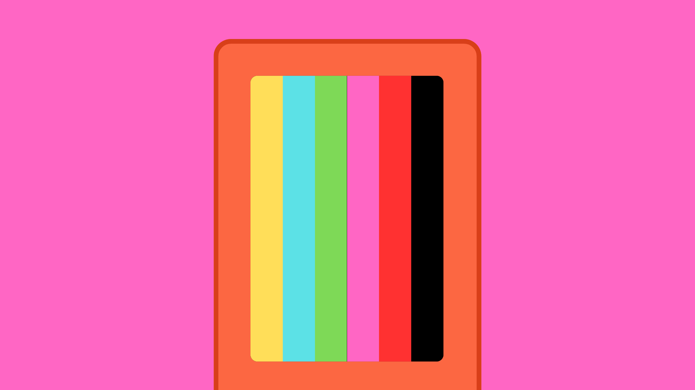

# M5StickC Plus Built-in LCD Display



## Contents

- [Introduction](#introduction)
- [Printing to the Display](#printing-to-the-lcd-display)
    - [Defined Colours](#defined-colours)
    - [Screen](#screen)
        - [Rotation](#rotation)
        - [Colour](#background-colour)
    - [Text](#text)
        - [Size](#text-size)
        - [Colour](#text-colour)
        - [Position](#cursor-position)
        - [Basic Print](#print)
        - [Print + New Line](#print--new-line)
        - [Print Formatted String](#print-formatted-string)
    - [Shapes](#shapes)
        - [Pixel](#single-pixel)
        - [Line](#line)
        - [Rectangle](#rectangle)
        - [Circle](#circle)
        - [Triangle](#triangle)

## Introduction
One of the first things you will see when you open an M5StickC Plus is the in-built 1.14 inch TFT LCD screen. This screen gives us a lot of creative options for creating displays and interfaces for our projects.

The display is fully programmable and can output RGB colours. The screen has a resolution of 135x240 pixels, which may seem low compared to a smartphone, but can provide enough detail for most projects.

The M5StickC Plus library provides us with lots of useful functions for using the display, including options for creating shapes, text and even X BitMap images.


## Printing to the LCD Display
The M5StickC Plus library provides us with several methods for printing text and shapes to the built-in LCD display. These methods abstract away the complexity of creating shapes and symbols using code and sending the right signals to  display them. Here we will look at some useful common LCD methods.

As always when using the onboard components on the M5StickC Plus, the project sketch will need to include the M5StickC Plus library at the top, and <code>M5.begin()</code> inside the <code>setup()</code> function.

``` cpp
#include <M5StickCPlus.h>

void setup() {
    M5.begin();
}
```

### Defined Colours
The M5StickC Plus library give us some default colour definitions to use in our code for changing text, shape and background colour:

| Definition  | Hex Value | Red | Green | Blue | 
| :---------- | :-------: | :-: | :---: | :--: | 
| BLACK       | 0x0000    | 0   | 0     | 0    |
| WHITE       | 0xFFFF    | 255 | 255   | 255  |
| LIGHTGREY   | 0xC618    | 192 | 192   | 192  |
| DARKGREY    | 0x7BEF    | 128 | 128   | 128  |
| RED         | 0xF800    | 255 | 0     | 0    |
| MAROON      | 0x7800    | 128 | 0     | 0    |
| MAGENTA     | 0xF81F    | 255 | 0     | 255  |
| PINK        | 0xFC9F    | 255 | 255   | 16   |
| YELLOW      | 0xFFE0    | 255 | 255   | 0    |
| ORANGE      | 0xFDA0    | 255 | 180   | 0    |
| GREEN       | 0x07E0    | 0   | 255   | 0    |
| DARKGREEN   | 0x03E0    | 0   | 128   | 0    |
| OLIVE       | 0x7BE0    | 128 | 128   | 0    |
| GREENYELLOW | 0xB7E0    | 180 | 255   | 0    |
| CYAN        | 0x07FF    | 0   | 255   | 255  |
| BLUE        | 0x001F    | 0   | 0     | 255  |
| NAVY        | 0x000F    | 0   | 0     | 128  |
| DARKCYAN    | 0x03EF    | 0   | 128   | 128  |
| PURPLE      | 0x780F    | 128 | 0     | 128  |

We do have the option to create more specific colours using RBG and Hex values, but these definitions give us a quick and easy way to start printing colour to our screens. For example, the method <code>M5.Lcd.fillScreen(BLUE)</code> will fill the LCD screen with a defined colour - blue in this case.

### Screen
The M5StickC Plus library gives us some options for setting up the screen before we start printing anything to it.

#### Rotation
We can set the rotation of the screen using <code>M5.Lcd.setRotation()</code>. By passing an integer argument between 0-3, we can rotation the screen 90° at a time in the clockwise direction. I.e.:

- 0 = 0°
- 1 = 90°
- 2 = 180°
- 3 = 270°

``` cpp
M5.Lcd.setRotation(1); // rotate screen 90° CLOCKWISE
```

#### Background colour
<code>M5.Lcd.fillScreen()</code> will fill the whole screen with a single defined colour. We can pass a colour definition ([see previous section](#defined-colours)) as an argument to choose which colour we want.

``` cpp
M5.Lcd.fillScreen(GREEN); // set the screen to green (0, 255, 0)
```

### Text
The library also has methods for printing text the the display. This would be considerably more difficult without these methods. 

If you want to see a full example sketch to test these methods yourself, you can find one [here](M5_LCD_Text/M5_LCD_Text.ino).

#### Text Size
``` cpp
M5.Lcd.setTextSize(2); // change text size (default=1)
```

#### Text Colour
``` cpp
M5.Lcd.setTextColor(RED);  // change text color (default=WHITE)
```

#### Cursor Position
This sets the position of the "cursor" which determines where the text will start printing from. 

This method requires a coordinate position of where ou would like to start printing from. Bear in mind, the LCD display has a resolution of 135x240 pixels, and you can decide at which pixel coordinate you want the text to start.

``` cpp
// x, y
M5.Lcd.setCursor(10, 25); // start printing from x=10, y=25
```

#### Print
``` cpp
M5.Lcd.print("Hello World"); // print "Hello World" to LCD display
```

#### Print + New Line
``` cpp
M5.Lcd.println("Hello"); // print "Hello" and create a new line
M5.Lcd.print("World");   // will print on the next line down
```

#### Print Formatted String
<code>M5.Lcd.printf()</code> is a C style print formatted string function. This provides the option to include variables in a string that can be replaced by inputting extra arguments to the function.

- %i  can be replaced by an integer value.
- %f can be replaced by a float value.
- %s can be replaced by a string.

We can then replace these string arguments with subsequent function arguments (i.e., separated by commas).

``` cpp
// Print "I am Joe and I am 25 years old"
M5.Lcd.printf("I am %s I am %i years old", "Joe", 25);

// Print "I am 3.1415 m tall"
M5.Lcd.printf("I am %f m tall", 3.1415);
```
### Shapes
The library also has methods for printing shapes the the display. This would be considerably more difficult without these methods. 

If you want to see a full example sketch to test these methods yourself, you can find one [here](M5_LCD_Shapes/M5_LCD_Shapes.ino).

#### Single Pixel
``` cpp
M5.Lcd.drawPixel(130, 240, YELLOW);  // x, y, colour
```

#### Line
``` cpp
M5.Lcd.drawLine(30, 200, 130, 200, BLACK);  // x1, y1, x2, y2, colour
```

#### Rectangle
``` cpp
// x, y, width, height, colour
M5.Lcd.drawRect(0, 0, 67, 67, CYAN);    // hollow
M5.Lcd.fillRect(67, 0, 68, 68, MAROON); // filled
​
// x, y, width, height, corner radius, colour
M5.Lcd.drawRoundRect(0, 68, 67, 67, 4, ORANGE); // hollow
M5.Lcd.fillRoundRect(67, 68, 68, 68, 8, GREEN); // filled
```

#### Circle
``` cpp
// x0, y0, radius, colour
M5.Lcd.drawCircle(67, 67, 50, YELLOW); // hollow
M5.Lcd.fillCircle(50, 180, 50, BLUE);  // filled
```

#### Triangle
``` cpp
// x1, y1, x2, y2, x3, y3, colour
M5.Lcd.drawTriangle(22, 22, 69, 98, 51, 22, RED);    // hollow
M5.Lcd.fillTriangle(100, 100, 100, 0, 135, 0, NAVY); // filled
```