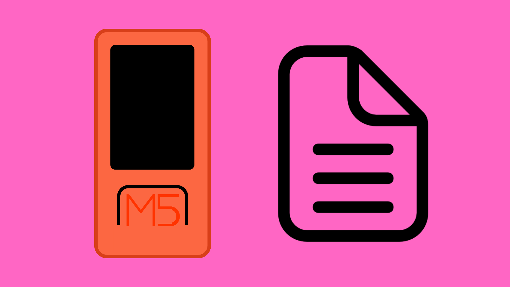

# Using SPIFFS with M5StickC-Plus



## Contents

- [Introduction](#introduction)
- [Usage](#usage)
    - [Format SPIFFS](#formatting)
    - [Writing](#writing-files)
    - [Reading](#reading-files)
    - [Appending](#appending-data-to-a-file)
    - [Remove File](#removing-files)

## Introduction
SPI Flash File Storage (or [SPIFFS](https://docs.espressif.com/projects/esp-idf/en/latest/esp32/api-reference/storage/spiffs.html)) is a file system for saving files to the internal SD onboard the ESP32 chip inside the M5StickC-Plus board. This allows us to easily create, store, and read files on the M5Stick. 

As most runtime data is erased after we end the program, we cannot easily store data that will persist after the device is powered off. Using SPIFFS can allow us to do exactly this. This can be useful for storing configuration data, game high-scores, or other data that needs to be saved, even while the M5Stick is powered off.

We can use the methods given to use by the SPIFFS Arduino library to create, delete, edit, and read from files using SPIFFS. In this page, we will look at how to do this on the M5StickC Plus.

## Usage
For a full example sketch, [click here](M5_SPIFFS_Reference/M5_SPIFFS_Reference.ino).

To make use of the prewritten classes and functions for working with SPIFFS, we will need to include the SPIFFS library at the top of the project sketch. We will also include the M5StickC Plus library to make use of the code for working with the M5StickC Plus board.

We can also initialise the <code>SPIFFS</code> and <code>M5</code> objects inside the <code>setup()</code> function.

``` cpp
#include <M5StickCPlus.h>
#include <SPIFFS.h>
  
void setup() {
  // Initialise M5Stick
  M5.begin();
  
  // Start SPIFFS
  while (!SPIFFS.begin()) {
    M5.Lcd.println("Failed to start SPIFFS. Retrying in 3 seconds...");
    delay(3000);
  }

  ...
```

### Formatting
Before creating files on your M5StickC Plus board, it may be worth formatting the storage to delete any files that may already be stored on it. This will clear any files that may have been created in previous projects, and thus creating more storage space for you to use in your next project.

To do this we can use the <code>SPIFFS.format()</code> method after initialising the <code>SPIFFS</code> object.

``` cpp
// Format SPIFFS
SPIFFS.format();
```

### Writing Files
Creating and overwriting files on your M5Stick will require the exact same code to achieve. Both require simply a opening a file in “write” mode. In this mode, existing files will be overwritten, and a file that does not yet exist will be created.

After initialising the <code>SPIFFS</code> object, we can open a file in "write" mode and store it in a <code>File</code> object.

**Important:** opening a file in "write" mode will overwrite any existing files with the same name. Make sure you do not do this if you want to keep the previous file. To check if a file with the same name already exists, we can use the <code>SPIFFS.exists()</code> method, which will return true if the file exists, and false if it does not.

``` cpp
// Check if file exists
if (!SPIFFS.exists(filepath)) {
    M5.Lcd.println("File exists\nReady to overwrite...")
}

// Create/open file
File file = SPIFFS.open("test.txt", "w");
```

We will then need to check if the file has been opened correctly before proceeding. If it has, we can use a <code>print()</code> statement to write some data to the file. 

**Important:** make sure to close the file once you have finished writing to it. This can case some issues if you do not.

``` cpp
if (file) {
    file.print("Hello World!"); // write "Hello World!" to file
    file.close();
} else {
    M5.Lcd.println("Unable to open file");
}
```

### Reading Files
Once we have written some files to our M5Stick, we will need to be able to read the data stored in these files. 

After initialising the <code>SPIFFS</code> object, we can open a file in "read" mode and store it in a <code>File</code> object.

``` cpp
// Check file exists
if (!SPIFFS.exists("test.txt")) {
    M5.Lcd.println("File not found.");
    while (true) {} // do not continue if file does not exist
}

// Open file in read mode
File file = SPIFFS.open("test.txt", "r");
```

We will then need to check if the file has been opened correctly before proceeding. If it has, we can use a <code>for()</code> loop to read through the data in the file and store it to a string variable.

**Important:** make sure to close the file once you have finished writing to it. This can case some issues if you do not.

``` cpp
String data = ""; // variable for storing data

// Check if file opened correctly
if (file) {
    // Read contents to data
    for (int i = 0; i < file.size(); i++)
        data += (char)file.read();
    
    file.close(); //close file
} else {
      M5.Lcd.println("Unable to open file");
}
```

The data from the file should then be stored in the string variable, ready to use later in the sketch.

### Appending Data to a File
As well as writing and reading to/from files, you may also want to add data to the end of a file. Appending data to a file is especially useful for data logging as you will likely want to write data to a file while keeping the previous data.

After initialising the <code>SPIFFS</code> object, we can open a file in "append" mode and store it in a <code>File</code> object.

``` cpp
// Check file exists
if (!SPIFFS.exists("test.txt")) {
    M5.Lcd.println("File not found.");
    while (true) {} // do not continue if file does not exist
}

// Open file in append mode
File file = SPIFFS.open("test.txt", "a");
```

We will then need to check if the file has been opened correctly before proceeding. If it has, we can use a <code>print()</code> statement to append some data to the file. 

**Important:** make sure to close the file once you have finished writing to it. This can case some issues if you do not.

``` cpp
if (file) {
    file.print("Some more data"); // append "Some more data" to file
    file.close(); // close file
  } else {
    M5.Lcd.println("Unable to open file");
  }
```

### Removing Files
You may also want to remove individual files without formatting the SPIFFS entirely.

To do this, we can simply initialise the <code>SPIFFS</code> object and use the <code>SPIFFS.remove()</code> method to remove a defined file. We will need to pass the name of the file as an method argument.

``` cpp
// Remove file from SPIFFS
SPIFFS.remove("test.txt");
```