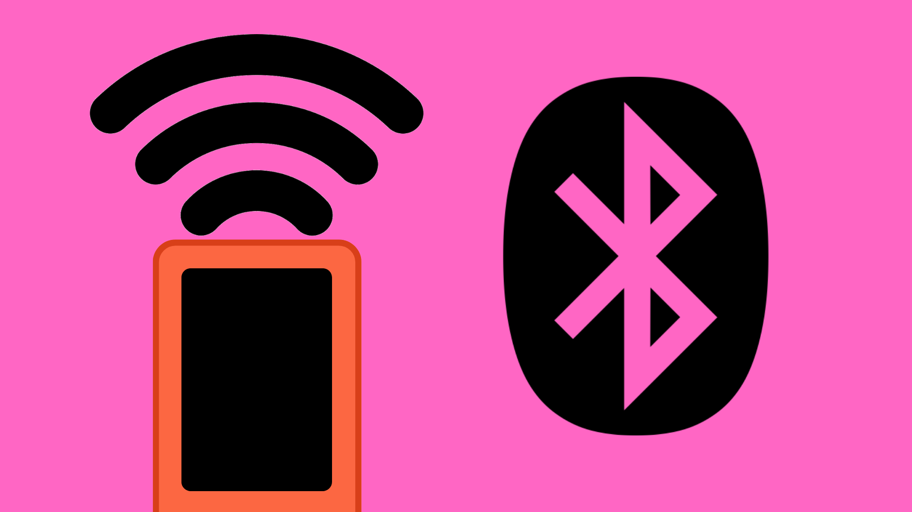
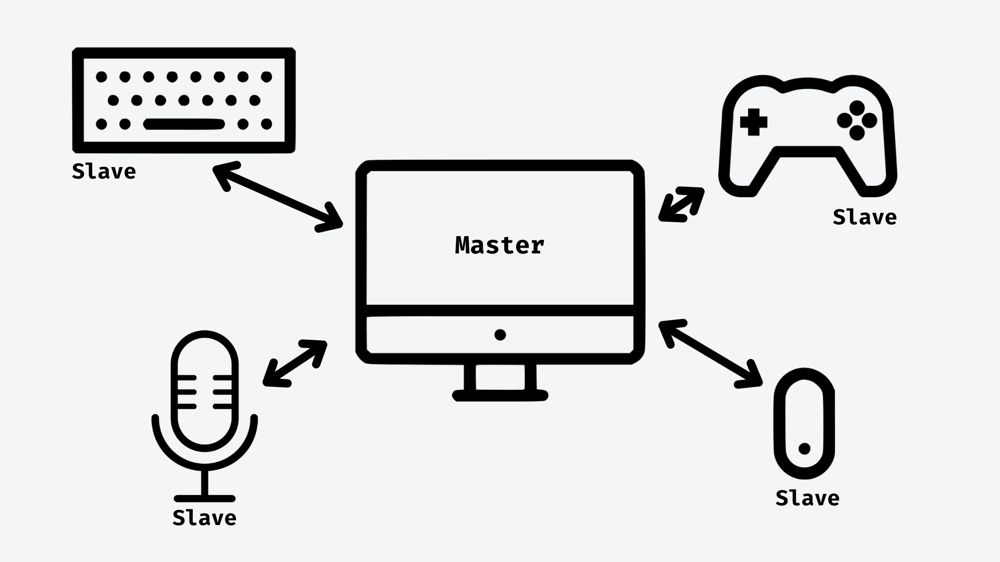

# Bluetooth with M5StickC Plus



## Contents
- [Introduction](#introduction)
    - [Master vs Slave Devices](#master-vs-slave-devices)
    - [Master or Slave?](#should-my-device-be-master-or-slave)
- [Usage](#usage)
    - [IncludeLibrary](#include-bluetoothserialh-library)
    - [Setup](#setup)
    - [Connecting - Master device](#connecting---master-device)
    - [Connecting - Slave device](#connecting---slave-device)
    - [Send Bluetooth messages](#send-bluetooth-messages)
    - [Receive Bluetooth messages](#receive-bluetooth-messages)

## Introduction

The M5StickC Plus provides us with the option of using Bluetooth as another means of wireless communication in our projects. With the `BluetoothSerial.h` library, we can easily send and receive data over Bluetooth using your M5StickC Plus. This makes it ideal for projects where wireless communication between the M5StickC Plus and other Bluetooth-enabled devices is required, such as sending sensor data or controlling devices remotely.

### Master vs Slave Devices
Bluetooth communication between devices requires us to set one device as a the "master" device, and up to seven devices as "slave" devices. This structure allows the master to communicate with up to seven other Bluetooth devices, but means each slave device can only connect to one master at a time.

You can think of this like connecting multiple (slave) devices like mouse, keyboard and headphones to one (master) device like a laptop or computer. In this example, it makes sense for the master device to be able to connect to multiple slave devices without them connecting to another computer. 



You might also notice in this example that slave devices can both send data (like the mouse and keyboard) and receive data (like the headphones). The master/slave model does not mean that the communication is only one-way; it is simply a way of organizing and managing the communication flow between devices.

### Should my device be Master or Slave?

In IoT projects that use Bluetooth communication, it is important to determine whether your device should be a master or slave device. Generally, when you are using your M5Stick to receive Bluetooth data from another device (e.g. a phone or computer) you should set your M5Stick to act as a slave device. If you are trying to send data between two M5Sticks, you will need to set one as a master device and the other as a slave device.

## Usage
### Include BluetoothSerial.h Library

To make use of Bluetooth classic communication, we first need to include the `BluetoothSerial.h` library. This will give us the `BluetoothSerial` class which contains the functions we need to connect devices and send and receive data using Bluetooth.

``` cpp
#include <BluetoothSerial.h>

// Create Bluetooth Serial object
BluetoothSerial bluetooth;
```

### Setup
To start Bluetooth on the slave device, we can use the `BluetoothSerial::begin()` function. We will need to pass it two arguments:

1. **Device Name** - the name we want to give the device. This will appear when we scan for Bluetooth devices. You can call this anything you want.
2. **Is master?** - a boolean (`true` or `false`) indicating whether this device is a master device. This is set to false by default.

``` cpp
BluetoothSerial bluetooth;

void setup() {
    // Start Bluetooth Serial
    // "false" argument sets this device to be slave device
    bluetooth.begin("M5_Slave_Example_Device", false);

...
```

### Connecting - Master device
[Full example sketch here](./M5Stick_Bluetooth_MasterDevice/M5Stick_Bluetooth_MasterDevice.ino).

To connect a master device to a slave device, we have to know the name of the slave device. This is the same name set up in the [previous section](#setup).

Once we know the name of the slave device, we can connect to it using `BluetoothSerial::connect()`.

``` cpp
// Start Bluetooth as master device
bluetooth.begin("M5_Master", true);

// Wait until connected to "M5_Slave" device
while (!bluetooth.connect("M5_Slave")) {}
```

### Connecting - Slave device
[Full example sketch here](./M5Stick_Bluetooth_SlaveDevice/M5Stick_Bluetooth_SlaveDevice.ino).

Unlike the master device, the slave does not need to know the name of the master device it is connecting to. We can simply use `BluetoothSerial::connected()` to check if the device is connected or not.

``` cpp
// Start Bluetooth as slave device
bluetooth.begin("M5_Slave", true);

// Wait until connected
while (!bluetooth.connected()) {}
```

### Send Bluetooth messages
Once connected, we can send Bluetooth messages to the connected device using the `BluetoothSerial::print()` function.

``` cpp
bluetooth.print("Hello");
```

### Receive Bluetooth messages
To read incoming Bluetooth messages, we can use the `BluetoothSerial::available()` function to check if there are any new Bluetooth messages and the `BluetoothSerial::read()` function to read the incoming data. 

This function will return each character (a letter, number or symbol) as an integer value. To convert incoming messages to String data, we need to read each incoming character and  add it to a String variable.

``` cpp
// Check for any incoming messages
if (bluetooth.available()) {
    String messageIn = "";

    // Add incoming characters to String
    while (bluetooth.available()) {
        messageIn += char(bluetooth.read());
    }

    // Print incoming message
    Serial.print("Received: ");
    Serial.println(messageIn);
}
```