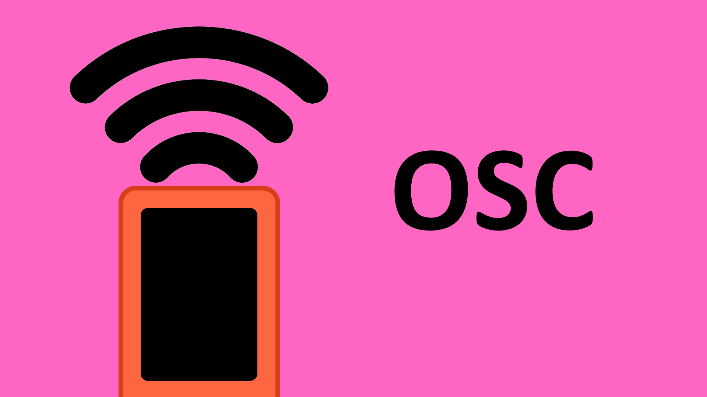

# Open Sound Control (OSC) with M5StickC-Plus



## Contents

- [Introduction](#introduction)
    - [What is OSC?](#what-is-osc)
    - [Message Structure](#message-structure)
    - [Sending OSC Data](#sending-osc-data)
- [Usage](#usage)
    - [Examples](#examples)

## Introduction
### What is OSC?
[Open Sound Control (OSC)](https://opensoundcontrol.stanford.edu/) is a communication protocol developed at UC Berkeley for real-time message exchange between software applications and hardware.

Originally created for low-latency communication, it was specifically designed for use in real-time musical performance. OSC has now expanded beyond just sound applications and is used in a variety of real-time interactive applications.

OSC messages can be sent over Wi-Fi networks, and so your M5Stick needs to be connected to either a Wi-Fi router or local network to send OSC messages to other devices on the same network.

### Message Structure
OSC messages are typically made up of a few components:

- **an address** - will determine how the message is interpreted by the receiver.
- **a value** - the data we want to send.

The address is a string starting with a forward slash (**/**) and can include multiple levels, much like a directory path (e.g., */synth/frequency*). It directs the message to the appropriate parameter or function on the receiving device.

For example, if we wish to send data from an M5Stick, the first level might be called *M5Stick*. If we are sending button data, we might include a second level called *Buttons*. Finally, we might want to include a level that specifies which button we are referring to - e.g. *Home*. This address would then be put together and the value added to the end of the message, like so:

```
M5Stick/Buttons/Home 0
```

This gives us the option to send button data from another button on the M5Stick with a slightly different address, for example:

```
M5Stick/Buttons/Reset 0
```

The receiving device should then be able to easily differentiate between data sent from the Home button and data sent from the Reset button on the M5Stick.

### Sending OSC Data
**Important:** to send OSC data to another device requires the sending and receiving device to be connected to the same network.

Once an OSC message has been created, it can be sent over a network using User Datagram (UPD) protocol. This simply requires us knowing two things about the device we are sending to:

- **IP Address**.
- **Network Port**.

An **IP address** is provided to each device on a network by the network host and should look something like <code>10.192.4.96</code>. The first three numbers in the IP address will define the address of the network, and all device addresses on the same network should share these numbers. The last number of the address is specific to each device on the network.

To find the IP address of the receiving device, you can:

- **Windows:** navigate to *Start > Settings > Network & Internet > Wi-Fi* and select the Wi-Fi network you are on. Under *Properties*, your IP address should be listed next to <code>IPv4 address</code>.
- **Mac:** open the *Apple Menu* and navigate to *System Settings*. From there, navigate to *Network > Wi-Fi > Details* and your IP address should be listed next to <code>IP address</code>.
- **M5Stick:** create a sketch to [connect to your local Wi-Fi network](/examples/Wireless-Communication/Wi-Fi/README.md). You can then print the M5Stick's IP address to the LCD display using the line <code>M5.Lcd.print(WiFi.localIP());</code>. 

The **network port** is the port your receiving device is listening on. It is a logical connection that is used by programs and services to exchange information. These ports are represented by an integer number between 0-65535.

Ports 0-1023 are usually taken by other communication services, such as HTTP and HTTPS (ports 80 and 443 respectively). As such, you should only make use of a port number between 1024-65535 for sending OSC messages.

It is important that the sending and receiving device both communicate via the same network port.

## Usage
To start sending/receiving OSC messages using the M5Stick, you will first need to install the [OSC library by Adrian Freed](https://github.com/CNMAT/OSC). This contains all the necessary functions for sending OSC messages.

In your code, you will need to connect your M5Stick to your local Wi-Fi network. You can see how to do this [here](/examples/Wireless-Communication/Wi-Fi/README.md). You will also need to specify the IP address and network port of the device you are sending to.

### Examples
- [Basic OSC Send](BasicOSCSend/BasicOSCSend.ino)
- [Basic OSC Receive](BasicOSCReceive/BasicOSCReceive.ino)
- [Send Int Data](SendInt_Counter/SendInt_Counter.ino)
- [Send Float Data](SendFloat_IMU/SendFloat_IMU.ino)
- [Send String Data](SendTxt_HelloWorld/SendTxt_HelloWorld.ino)