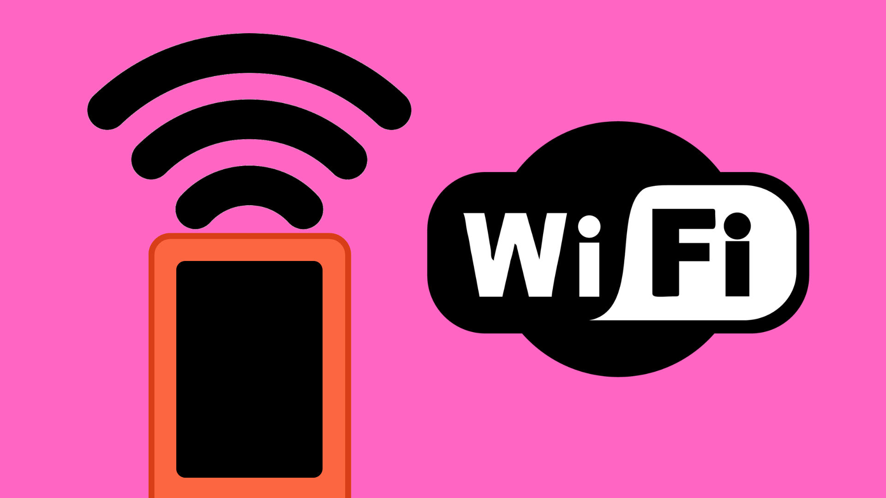

# Wi-Fi with an M5StickC Plus



## Contents

- [Introduction](#introduction)
- [Usage](#usage)
    - [Connect to Wi-Fi](#connecting-to-wi-fi)
    - [Create Access Point](#creating-a-wi-fi-access-point)

## Introduction
The M5StickC Plus contains an internal Wi-Fi antenna, allowing it to both connect to Wi-Fi networks and create start their own local wireless networks. This gives us the option to communicate with other devices, both over the internet and local networks. 

An internet connection allows you to make use of [APIs](/examples/Wireless-Communication/APIs/README.md) and [cloud services](/examples/Cloud-Services). This can be really useful for pulling and pushing data to and from other parts of the world. With this, we are no longer limited to only connecting to devices within the same room.

Creating local network connections will allow you to send data directly to other devices using protocols like [OSC](/examples/Wireless-Communication/OSC/README.md). This can be a very fast and convenient way of transferring data.

The M5StickC Plus supports 2.4 GHz Wi-Fi networks but does not support 5 GHz Wi-Fi networks directly. It also cannot connect directly to the Eduroam network due to the layers of security involved; however, there is a dedicated network on campus for IoT devices like the M5StickC Plus.

If you have an M5StickC Plus board and wish to connect it to the university's IoT network, please contact DigiDevECA@ed.ac.uk for more information.

## Usage
To make use of the M5StickC Plus' Wi-Fi capabilities in your project, you must first include the M5StickC Plus and WiFi libraries at the top of your project sketch. 

It is also worth storing your Wi-Fi ssid (network name as it appears when you search for networks on your phone/computer) and password as variables to use later.

``` cpp
#include <M5StickCPlus.h>
#include <WiFi.h>
  
//=======================================================
// **REPLACE THESE VARIABLES WITH YOUR DETAILS**
const char *ssid = "MyNetwork";
const char *password = "MyPassword";
//=======================================================
```

### Connecting to Wi-Fi
For the full example sketch, [click here](M5_WiFi_StationMode/M5_WiFi_StationMode.ino).

To connect to a Wi-Fi network, we can use some functions provided by the WiFi Arduino library.

First we need to set the Wi-Fi mode to "Station Mode". This allows us to join a network that already exists.

``` cpp
// initialise - WIFI_STA = Station Mode
WiFi.mode(WIFI_STA);
```

We can then start the connection using <code>WiFi.begin()</code> and passing in the ssid and password variables we created earlier.

``` cpp
// Start connection
WiFi.begin(ssid, password);
```

For most applications, we will not want to proceed until the connection is established. To make this is the case, we can use a <code>while()</code> loop to make sure we don't continue until the connection is confirmed.

``` cpp
// Wait until connected
while (WiFi.status() != WL_CONNECTED) {}
```

And with that, the M5Stick will try to establish a connection to the specified Wi-Fi network and will only proceed if it is successful. It may be worth adding a print before, inside, and after the <code>while()</code> loop to make sure we know that the M5Stick is indeed trying to connect and to confirm the connection.

``` cpp
M5.Lcd.print("Connecting");

// Wait until connected
while (WiFi.status() != WL_CONNECTED) {
  M5.Lcd.print(".");
  delay(400);
}

M5.Lcd.print("Connected");
```

### Creating a Wi-Fi Access Point
For the full example sketch, [click here](M5_WiFi_AccessPoint/M5_WiFi_AccessPoint.ino).

As well as being able to connect to Wi-Fi networks, the M5Stick can also start a Wi-Fi “Access Point”. This essentially creates a wireless network that other devices can connect to.  

Bear in mind,  this does not provide an internet connection. It does, however, allow other devices to connect to the same network and wirelessly transfer data between each other.

To start a Wi-Fi access point from the M5Stick, you can set the Wi-Fi mode to "Access Point".

``` cpp
// initialise - WIFI_AP = Access Point Mode 
WiFi.mode(WIFI_AP);
```

We can then start the access point using the ssid and password we set earlier. These will determine the ssid and password that other devices will need to connect to this access point, so you can set them to anything you want.

We will also want to wait until the access point has been established before continuing.

``` cpp
// start access point
while (!WiFi.softAP(ssid, pass)) {
    M5.Lcd.println("Err: Access Point Failed");
    delay(2000);
}
```